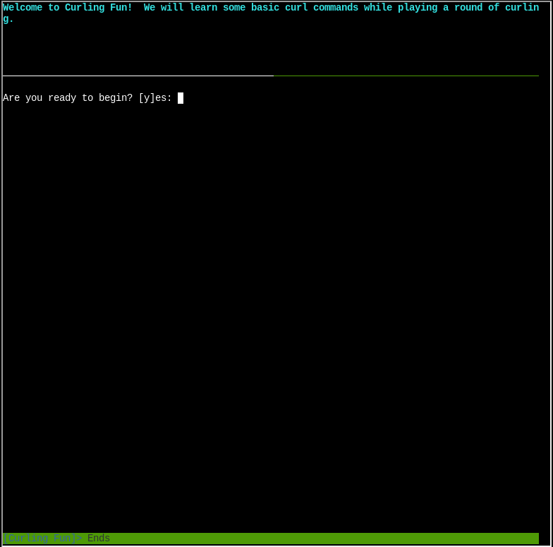

# cURLing

Difficulty: :material-star::material-star-outline::material-star-outline::material-star-outline::material-star-outline:

## Objective

!!! question "Task description"

    Team up with Bow Ninecandle to send web requests from the command line using Curl, learning how to interact directly with web servers and retrieve information like a pro!

??? quote "Bow Ninecandle"

    Well hello there! I'm Bow Ninecandle, bright as a twinkling star! Everyone's busy unpacking, but I've grown quite bored of that. Care to join me for a lovely game?

    Oh Joy! Today, We're diving into something delightful: the curling challenge—without any ice, but plenty of sparkle!

    No icy brooms here though! We're all about {==Curl, sending web requests from the command line==} like magic messages.

    So, have you ever wielded Curl before? If not, no worries at all, my friend!

    It's this clever little tool that lets you whisper directly to web servers. Pretty neat, right?

    Think of it like sending secret scrolls through the interwebs, awaiting a wise reply!

    To begin, you can type something like curl https://example.com. Voilà! The HTML of the page appears, like conjuring a spell!

    Simple enough, huh? But oh, there's a whole world of magic you can cast with Curl!

    We're just brushing the surface here, but trust me—it’s a hoot and a half!

    If you get tangled up or need help, just give me a shout! I’m here to help you ace this curling spectacle.

    So, are you ready to curl those web requests like a pro? Let’s see your magic unfold!

## Hints

??? tip "cURL Manual"

    The official [cURL man page](https://curl.se/docs/manpage.html) has tons of useful information on how to use cURL.

??? tip "cURL: Don't squash"

    Take a look at cURL's "--path-as-is" option; it controls a default behavior that you may not expect!

## Solution

=== "Silver"

    This challenge presents us a terminal to experiment with using the command line tool 'curl'. It tasks us to formulate the correct curl command with various goals. We will tackle this using the curl manual that can be opened with ```man curl``` or using the [webpage](https://curl.se/docs/manpage.html) as linked by the hint.

    ??? success "Solution for question 1"

        !!! quote "Task"
            Unlike the defined standards of a curling sheet, embedded devices often have web servers on non-standard ports. Use curl to retrieve the web page on host "curlingfun" port 8080. If you need help, run the 'hint' command.

        We can simply add the port in the URL:

        ``` sh
        curl http://curlingfun:8080
        ```

    ??? success "Solution for question 2"

        !!! quote "Task"
            Embedded devices often use self-signed certificates, where your browser will not trust the certificate presented. Use curl to retrieve the TLS-protected web page at https://curlingfun:9090/

        Our first intuition should be to change to HTTPS. However, this gives us the following error:

        !!! failure

            ``` sh
            curl: (60) SSL certificate problem: self-signed certificate
            More details here: https://curl.se/docs/sslcerts.html

            curl failed to verify the legitimacy of the server and therefore could not
            establish a secure connection to it. To learn more about this situation and
            how to fix it, please visit the web page mentioned above.
            ```
        We need to instruct curl to trust the self-signed certificate. The is the [-k flag](https://curl.se/docs/manpage.html#-k) that lets curl skip the verification step. We can then send our request to the webbpage:

        ``` sh
        curl -k https://curlingfun:9090/
        ```

    ??? success "Solution for question 3"

        !!! quote "Task"
            Working with APIs and embedded devices often requires making HTTP POST requests. Use curl to send a request to https://curlingfun:9090/ with the parameter "skip" set to the value "alabaster", declaring Alabaster as the team captain.

        We can use the [-X flag](https://curl.se/docs/manpage.html#-X) to choose the type of HTTP request we are making and the [-d flag](https://curl.se/docs/manpage.html#-d) to include data:

        ``` sh
        curl -k -X POST https://curlingfun:9090/ -d "skip=alabaster"
        ```

    ??? success "Solution for question 4"

        !!! quote "Task"
            Working with APIs and embedded devices often requires maintaining session state by passing a cookie. Use curl to send a request to https://curlingfun:9090/ with a cookie called "end" with the value "3", indicating we're on the third end of the curling match.

        We can use the [-b flag](https://curl.se/docs/manpage.html#-b) to include a cookie in our request:

        ``` sh
        curl -k -b "end=3" https://curlingfun:9090/
        ```

    ??? success "Solution for question 5"

        !!! quote "Task"
            Working with APIs and embedded devices sometimes requires working with raw HTTP headers. Use curl to view the HTTP headers returned by a request to https://curlingfun:9090/

        We can use the [-v flag](https://curl.se/docs/manpage.html#-v) to make our request verbose:

        ``` sh
        curl -k -v https://curlingfun:9090/
        ```

    ??? success "Solution for question 6"

        !!! quote "Task"
            Working with APIs and embedded devices sometimes requires working with custom HTTP headers. Use curl to send a request to https://curlingfun:9090/ with an HTTP header called "Stone" and the value "Granite".

        We can use the [-H flag](https://curl.se/docs/manpage.html#-H) to add a custom header to our request:

        ``` sh
        curl -H 'Stone: Granite' -k https://curlingfun:9090//
        ```

    ??? success "Solution for question 7"

        !!! quote "Task"
            curl will modify your URL unless you tell it not to. For example, use curl to retrieve the following URL containing special characters: https://curlingfun:9090/../../etc/hacks

        The task description tells us that apparently curl modifies requests sometimes. When requesting this URL, curl will change it to the following

        ``` sh
        GET /etc/hacks HTTP/1.1
        ```

        To prevent this from happening, we use our second hint and add the [--path-as-is flag](https://curl.se/docs/manpage.html#--path-as-is):

        ``` sh
        curl -k --path-as-is https://curlingfun:9090/../../etc/hacks
        ```

        This will grant us the silver achievement.

=== "Gold"

    To get started with gold, we need to find our instructions first. We find them in Alabaster's home folder in "HARD-MODE.txt":

    ```
    alabaster@curlingfun:~$ ls
    HARD-MODE.txt  HELP
    ```

    ??? success "Solution for question 1"

        !!! quote "Task"

            ```
            alabaster@curlingfun:~$ cat HARD-MODE.txt
            Prefer to skip ahead without guidance? Use curl to craft a request meeting these requirements:

            - HTTP POST request to https://curlingfun:9090/
            - Parameter "skip" set to "bow"
            - Cookie "end" set to "10"
            - Header "Hack" set to "12ft"
            ```

        We need to combine some of the knowledge we just learned:

        ``` sh
        curl -X POST -k --cookie "end=10" -d "skip=bow" -H "Hack: 12ft" https://curlingfun:9090/
        ```

    ??? success "Solution for question 2"

        !!! quote "Task"

            Excellent! Now, use curl to access this URL: https://curlingfun:9090/../../etc/button

        This task is similar to question 7 for the silver achievement:

        ``` sh
        curl -k --path-as-is https://curlingfun:9090/../../etc/button
        ```

    ??? success "Solution for question 3"

        !!! quote "Task"

            Great! Finally, use curl to access the page that this URL redirects to: https://curlingfun:9090/GoodSportsmanship

        We need to instruct curl to follow any new locations of pages the server provides us (with HTTP 3XX codes). We use the [-L flag](https://curl.se/docs/manpage.html#-L):

        ``` sh
        curl -k -L https://curlingfun:9090/GoodSportsmanship
        ```

        This will grant us the gold achievement.

### Images



## Response

!!! quote "Bow Ninecandle"

    Bravo! Look at you, curling through that like a true web wizard!

    You zipped through that challenge faster than a curling stone on enchanted ice!

    Wait... did you just slice and dice it all into three commands? My stars, you're a Curling conjurer!
