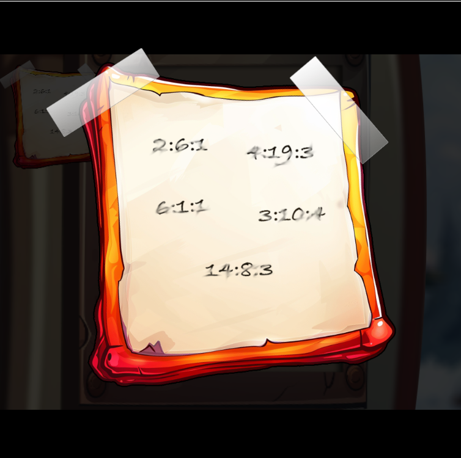
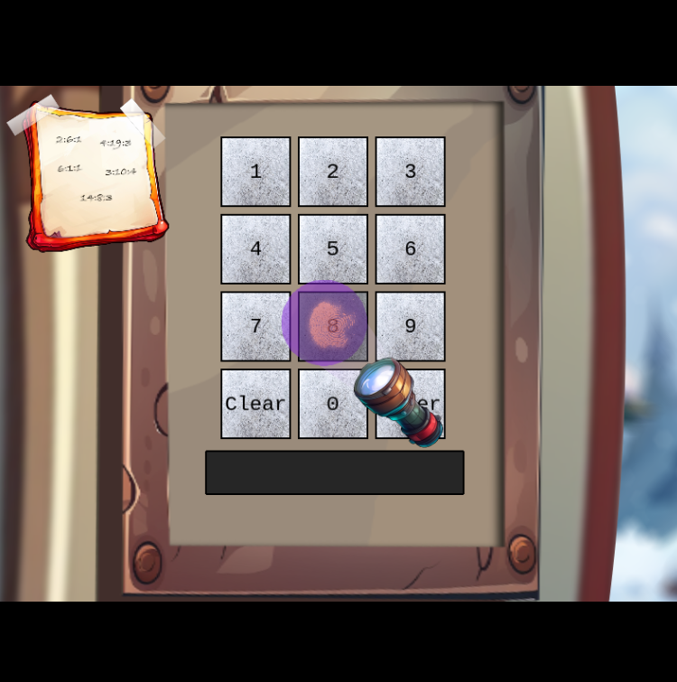

# Frosty Keypad

Difficulty: :material-star::material-star-outline::material-star-outline::material-star-outline::material-star-outline:

## Objective

!!! question "Task description"

    In a swirl of shredded paper, lies the key. Can you unlock the shredder’s code and uncover Santa's lost secrets?

??? quote "Morcel Nougat"

    Hello again! I'm Morcel Nougat, dashing around like a reindeer on a sugar rush! We've got a bit of a dilemma, and I could really use your expertise.

    Wombley and Alabaster have taken charge now that Santa’s gone missing, and We're scrambling to get the Wish List secured. But... one of the elves in the Data Management Team got overzealous, and the Shredder McShreddin 9000 gobbled up a crucial document we need to access Santa's chest!

    It’s our golden ticket to getting Santa’s Little Helper tool working properly. Without it, the hardware hack we're planning is as empty as Santa’s sleigh in January.

    Think you can help? I can get you into the Shredder McShreddin 9000’s inner workings to retrieve the pieces, but there are {==two access codes involved==}. One of the elves {==left a hint==}, but it’s all a blur to me!

    I've noticed that some elves keep referring to a {==certain book when they walk by==}. I bet it has the {==answers we need to crack the code==} and recover the document!

    You know, some of the elves always have their noses in the same book when they pass by here. Maybe it’s got the clues we need to crack the code?

## Hints

??? tip "Who Are You Calling a Dorf?"

    Hmmmm. I know I have seen Santa and the other elves use this keypad. I wonder what it contains. I bet whatever is in there is a {==National Treasure==}!

??? tip "Just Some Light Reading"

    See if you can {==find a copy of that book==} everyone seems to be reading these days. I thought I saw somebody {==drop one close by==}...

??? tip "Shine Some Light on It"

    Well this is puzzling. I wonder if {==Santa has a seperate code==}. Bet that would {==cast some light==} on the problem. I know this is a stretch...but...what if you had one of those {==fancy UV lights to look at the fingerprints on the keypad==}? That might at least limit the possible digits being used...

## Solution

=== "Silver"

    The conversation with Morcel and the hints give us quite some information to start analyzing this problem with. Checking the keypad, we see we can input the digits zero to nine.

    {width="500"}
    /// caption
    A standard keypad with maximum input lengh of five.
    ///

    There is an input length limit of five. In the top left corner we find the hint the elves left for us. It contains five number combinations:

    {width="500"}
    /// caption
    The hint provided by the elves.
    ///

    We likely need the book to use this hint. We walk around and find the book:

    {width="500"}
    /// caption
    The book is located behind this box.
    ///

    The book is now part of our inventory under 'items'. It redirects us to [this website](https://frost-y-book.com/) to display the book:

    {width="500"}
    /// caption
    The Frosty Book.
    ///

    Let's put the information available to us together. The hints refer to "National Treasure". This is a [movie](https://en.wikipedia.org/wiki/National_Treasure_(film)) in which the plot includes the usage of a [book cipher](https://en.wikipedia.org/wiki/Book_cipher), also known as an "Ottendorf cipher". These ciphers replace plaintext with some code that locates it in another text. These codes are often numbers that indicate book page, line, and word occurence. Using the book, the codes the elves gave us, and the cipher key logic "page:word:letter", we find the following plaintext:

    | Code          | Plaintext |
    | -             | - |
    | `2:6:1`       | S |
    | `4:19:3`      | A |
    | `6:1:1`       | N |
    | `3:10:4`      | T |
    | `14:8:3`      | A |

    We find the word 'SANTA'! However, we will need to convert this to numbers somehow. In the past, keypads were also used to write text on phones with [Multi-tap](https://en.wikipedia.org/wiki/Multi-tap). Every digit would represent some letters and multiple presses would let you cycle through them. In this case, we can only submit five digits and we would need more presses to use this system. There is also [T9 dialing](https://en.wikipedia.org/wiki/T9_(predictive_text)) which allows words to be formed with single key presses using a predictive system. We can use [this website](https://www.dcode.fr/t9-cipher) to encode our plaintext and find the digit combination that would give us this text:

    !!! success "Answer"

        ```72682``` will translate into 'santa'.

=== "Gold"

    Morcel gives us some additional hints when we talk to him after getting the silver achievement:

    !!! quote "Morcel Nougat"

        WOW, you did it! You know, they say Ottendorf ciphers were used back in the Frosty Archives crisis… or was that during the Jack Frost incident? Either way, you're amazing!

        But wait—there’s still one more code tucked away! This one might need a bit more elbow grease… you may need to {==try a few combinations to crack it!==}

    The conversation suggests that we need to brute-force our way in to find a second code. Our unused hints also tell us we can find a flashlight somewhere. We find it behind these boxes:

    {width="500"}
    /// caption
    The flashlight is located behind these boxes.
    ///

    We can then illuminate the keypad and see fingerprints on some keys, giving us an indication of which ones are used:

    {width="500"}
    /// caption
    The flashlight shows us which keys are used.
    ///

    We find that the following digits are used: ```26786```. In the DevTools we see the following request being made when we submit a code:

    {width="500"}
    /// caption
    The request made when submitting a code.
    ///

    Based on this information we can use the following Python script to find the code:

    ``` py title="Brute-force Python script" linenums="1"
    import itertools
    import requests
    import time

    # List of digits
    digits = '26786'

    # Generate all combinations of the digits (with repetition allowed)
    combinations = itertools.product(digits, repeat=len(digits))

    # Define the URL (you can modify this)
    url = '<YOUR_URL_HERE>'

    # Iterate over all combinations
    for combination in combinations: # Convert tuple to string
        answer = ''.join(combination)

    # Prepare payload
    payload = {"answer": answer}

    # Send POST request (you can modify this to a GET if needed)
    response = requests.post(url, json=payload)

    # Print request and complete response message
    print(f"Sent: {payload}")
    print(f"Response Status Code: {response.status_code}")
    print(f"Response Message: {response.text}\n")

    # Delay for 1 second between requests
    time.sleep(1)
    ```

    !!! example "AI usage"
        ChatGPT was used to quickly generate this code. The following set of prompts was used to get to the solution:

        ??? quote "Prompts"

            Provide me a Python script that will iterate over all combinations of the digits '26786' and use it as a parameter in a request payload in the format "{answer: <DIGITS>}". Let me add the URL to submit this request to myself.

            Show me the complete response message as well.

            Add a one second delay between every request.

            Allow digits to appear twice in the combinations.

    Running this script, we will eventually find the following code:

    ??? success "Answer"

        ```
        Sent: {'answer': '22786'}
        Response Status Code: 200
        Response Message: {"output":"success"}
        ```

## Response

!!! quote "Morcel Nougat"

    WOW, you did it! You know, they say Ottendorf ciphers were used back in the Frosty Archives crisis… or was that during the Jack Frost incident? Either way, you're amazing!

    But wait—there’s still one more code tucked away! This one might need a bit more elbow grease… you may need to try a few combinations to crack it!

    Unbelievable! You found a flaw in the system and completely bypassed the rate limiter. You’re practically an elf legend!

    Incredible work! You pieced together the code like a true sleuth and retrieved the shreds we need. I’m not quite sure how you’ll put them all together, but if anyone can, it’s you!

    Your help has been absolutely essential, especially now with Santa missing. Wombley and Alabaster will want to hear all about it—go share the news with Jewel Loggins!
