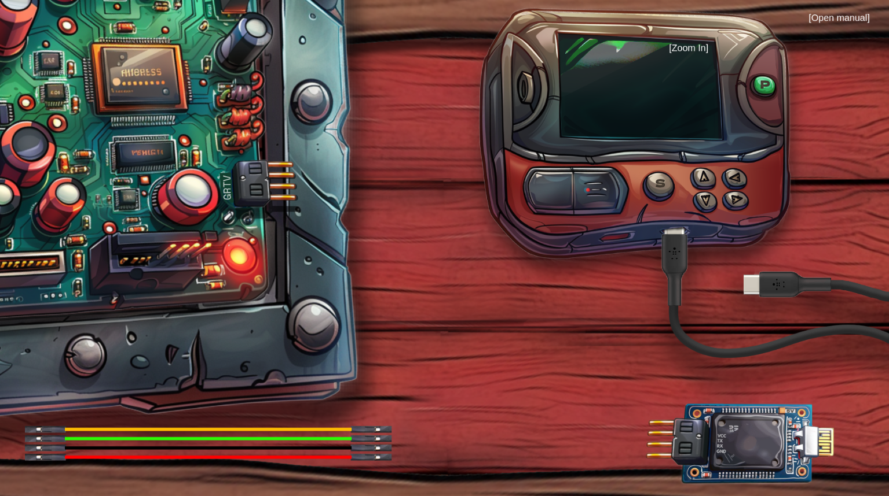
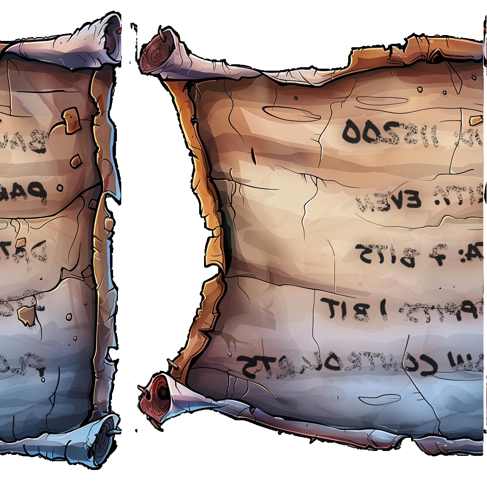
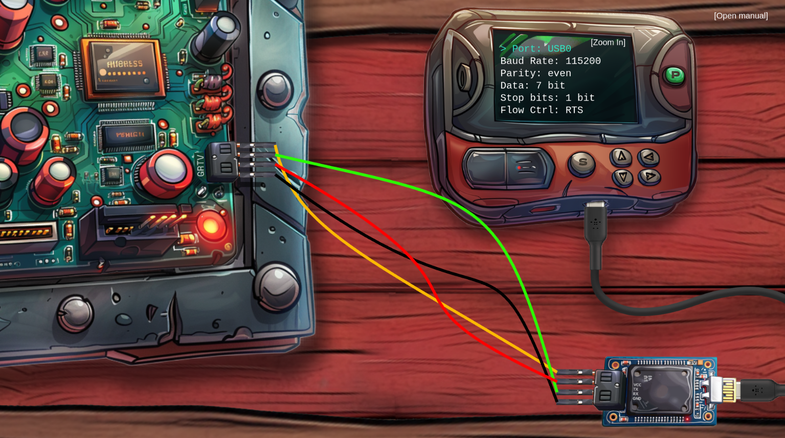
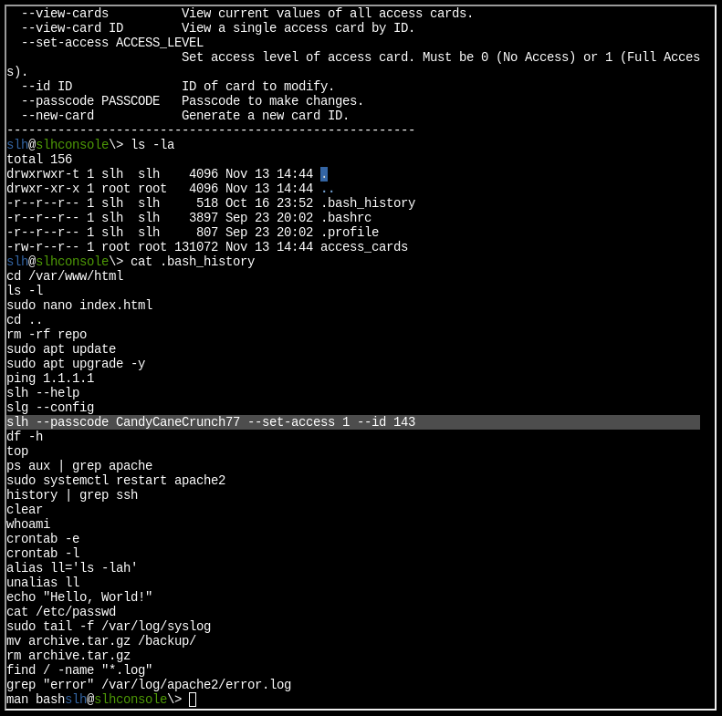

# Hardware Hacking 101

Difficulty: :material-star::material-star-outline::material-star-outline::material-star-outline::material-star-outline:

## Objective

!!! question "Task description"

    Ready your tools and sharpen your wits—only the cleverest can untangle the wires and unlock Santa’s hidden secrets!

    !!! question "Part 1"

        Jingle all the wires and connect to Santa's Little Helper to reveal the merry secrets locked in his chest!

    !!! question "Part 2"

        Santa’s gone missing, and the only way to track him is by accessing the Wish List in his chest—modify the access_cards database to gain entry!

??? quote "Jewel Loggins"

    Hello there! I’m Jewel Loggins.

    I hate to trouble you, but I really need some help. Santa’s Little Helper tool isn’t working, and normally, Santa takes care of this… but with him missing, it’s all on me.

    I need to connect to the {==UART interface==} to get things running, but it’s like the device just refuses to respond every time I try.

    I've got all the right tools, but I must be overlooking something important. I've seen a few elves with similar setups, but everyone’s so busy preparing for Santa’s absence.

    If you could guide me through the connection process, I’d be beyond grateful. It’s critical because this interface controls access to our North Pole access cards!

    We used to have a {==note with the serial settings==}, but apparently, one of Wombley’s elves shredded it! You might want to {==check with Morcel Nougat==}—he might have a way to recover it.

## Part 1

### Hints

??? tip "On the Cutting Edge"

    Hey, I just caught wind of this neat way to {==piece back shredded paper==}! It's a fancy heuristic detection technique—sharp as an elf’s wit, I tell ya! Got a sample Python script right here, courtesy of Arnydo. Check it out when you have a sec: [heuristic_edge_detection.py](https://gist.github.com/arnydo/5dc85343eca9b8eb98a0f157b9d4d719)."

??? tip "Shredded to Pieces"

    Have you ever wondered how elves manage to dispose of their sensitive documents? Turns out, they use this fancy shredder that is quite the marvel of engineering. It slices, it dices, it makes the paper practically disintegrate into a thousand tiny pieces. Perhaps, just perhaps, we could {==reassemble the pieces==}?

### Solution

=== "Silver"

    The challenge presents us the following:

    
    /// caption
    Challenge overview with a manual in the top right. We see two pieces of hardware, an UART-bridge, and some cables. We can drag and drop some of these items.
    ///

    We can drag and drop the wires and switch some settings on the hardware. Following the manual and using some of our common hardware knowledge, we take the following steps:

    - [x] Connect the wires to the hardware and UART-bridge as follows: ```G <-> GND, R <-> TX, T <-> RX, V <-> VCC```
    - [x] Connect the USB-C cable to the UART-bridge.
    - [x] Flip the voltage switch on the UART-bridge to '3V'.
    - [x] Power on 'Santa's Little Helper' (or 'SLH') with the green button.

    The SLH will turn on but when pressing the 'S' button to connect, we get an error. We will need the correct settings.

    The conversation with Jewel reveals that we must first work on the challenge 'Frosty Keypad' related to Morcel Nougat to get some shredded note. Once we have the item, it says the following:

    !!! note "One Thousand Little Teeny Tiny Shredded Pieces of Paper"

        A mountain of one thousand little tiny [shredded pieces of paper](https://holidayhackchallenge.com/2024/shreds.zip)—each scrap whispering a secret, waiting for the right hardware hacker to piece the puzzle back together!

    The .zip archive contains a set of .png images that represent slices of the shredded paper. One of the hints gives us a Python script that should be able to piece back shredded paper. When running this script in the 'shreds' folder, we get the following image:

    {width="500"}
    /// caption
    Piece of paper containing the configuration needed for the SLH.
    ///

    We flip the image over the X-axis with [CyberChef](https://gchq.github.io/CyberChef/#recipe=Render_Image\('Raw'\)Flip_Image\('Horizontal'\)) and get the following settings (assuming port to be the USB):

    !!! success "Answer"

        | Name          | Setting   |
        | -             | -         |
        | Port          | USB0      |
        | Baud Rate     | 115200    |
        | Parity        | even      |
        | Data          | 7 bits    |
        | Stop bits     | 1 bit     |
        | Flow control  | RTS       |

        
        /// caption
        Solution configuration.
        ///

    !!! quote "Jewel Loggins"

        Fantastic! You managed to connect to the UART interface—great work with those tricky wires! I couldn't figure it out myself…

        Rumor has it you might be able to {==bypass the hardware altogether for the gold medal==}. Why not see if you can find that shortcut?

=== "Gold"

    Jewel tells us that we might be able to bypass the hardware completely. This suggests we can do something with the JavaScript code as we have seen in previous challenges as well. In the DevTools we find the following:

    ``` js title="Hint contained in 'main.js'" linenums="1" hl_lines="4 5 6"
    async function checkit(serial, uV) {
        //..
        // Build the URL with the request ID as a query parameter
        // Word on the wire is that some resourceful elves managed to brute-force their way in through the v1 API.
        // We have since updated the API to v2 and v1 "should" be removed by now.
        // const url = new URL(`${window.location.protocol}//${window.location.hostname}:${window.location.port}/api/v1/complete`);
        const url = new URL(`${window.location.protocol}//${window.location.hostname}:${window.location.port}/api/v2/complete`);
        //..
    }
    ```

    !!! success "Answer"
        We use Burp to capture our final request for the silver achievement. Then we simply change the endpoint to the v1 API using the repeater and receive the gold achievement. We don't need to brute-force it this way, even though that might be the intended path to the solution. We could have brute-forced it with the Burp intruder.

        Example request:
        ```
        POST /api/v1/complete HTTP/2
        Host: hhc24-hardwarehacking.holidayhackchallenge.com
        Cookie: _ga=<FILL_IN>; _ga_F6ZZNPR5E5=<FILL_IN>; GCLB="<FILL_IN>"
        Content-Type: application/json
        Accept: */*
        Accept-Encoding: gzip, deflate, br

        {"requestID":"<YOUR_REQUEST_ID>","serial":[3,9,2,2,0,3],"voltage":3}
        ```

## Part 2

Jewel provides some more information:

!!! quote "Jewel Loggins"

    Next, we need to access the terminal and {==modify the access database==}. We're looking to grant access to {==card number 42==}.

    Start by using the slh application—that’s the key to getting into the access database. Problem is, the ‘slh’ tool is password-protected, so we need to find it first.

    Search the terminal thoroughly; passwords sometimes get {==left out in the open==}.

### Hints

??? tip "It's In the Signature"

    I seem to remember there being a handy HMAC generator included in [CyberChef](https://gchq.github.io/CyberChef/#recipe=HMAC\(%7B'option':'UTF8','string':''%7D,'SHA256'\)).

??? tip "Hidden in Plain Sight"

    It is so important to keep sensitive data like passwords secure. Often times, when typing passwords into a CLI (Command Line Interface) they get {==added to log files and other easy to access locations==}. It makes it trivial to step back in {==history==} and identify the password.

### Solution

=== "Silver"

    The hints suggest us to look into the bash history of the terminal. We boot the system the default way and check the logfile:

    
    /// caption
    The password is present in the bash history.
    ///

    With the password, we can then modify the permissions of card 42 using the SLH app. We look into the functionality:

    ```
    slh@slhconsole\> slh --help
    usage: slh [-h] [--view-config] [--view-cards] [--view-card ID] [--set-access ACCESS_LEVEL]
            [--id ID] [--passcode PASSCODE] [--new-card]

    Santa's Little Helper - Access Card Maintenance Tool

    options:
    -h, --help            show this help message and exit
    --view-config         View current configuration.
    --view-cards          View current values of all access cards.
    --view-card ID        View a single access card by ID.
    --set-access ACCESS_LEVEL
                            Set access level of access card. Must be 0 (No Access) or 1 (Full
                            Access).
    --id ID               ID of card to modify.
    --passcode PASSCODE   Passcode to make changes.
    --new-card            Generate a new card ID.
    ```

    !!! success "Answer"

        ```slh --id 42 --passcode CandyCaneCrunch77 --set-access 1```

    !!! quote "Jewel Loggins"

        Wow! You're amazing at this! Clever move finding the password in the command history. It’s a good reminder about keeping sensitive information secure…

        There’s a tougher route if you're up for the challenge to earn the Gold medal. It involves directly modifying the database and generating your own HMAC signature.

        I know you can do it—come back once you've cracked it!

=== "Gold"

    Jewel wants us to directly modify the database and generate our own HMAC signature. In the home folder there is an SQLite database:

    ```
    slh@slhconsole\> file access_cards
    access_cards: SQLite 3.x database, last written using SQLite version 3040001, file counter 4, database pages 32, cookie 0x2, schema 4, UTF-8, version-valid-for 4
    ```

    SQLite 3 is installed on the system so we can open the database to learn more:

    ```
    slh@slhconsole\> sqlite3 access_cards
    SQLite version 3.40.1 2022-12-28 14:03:47
    Enter ".help" for usage hints.
    sqlite> .tables
    access_cards  config
    sqlite> SELECT * FROM config
    ...> ;
    1|hmac_secret|9ed1515819dec61fd361d5fdabb57f41ecce1a5fe1fe263b98c0d6943b9b232e
    2|hmac_message_format|{access}{uuid}
    3|admin_password|3a40ae3f3fd57b2a4513cca783609589dbe51ce5e69739a33141c5717c20c9c1
    4|app_version|1.0

    sqlite> SELECT * FROM access_cards WHERE ID=42;
    42|c06018b6-5e80-4395-ab71-ae5124560189|0|ecb9de15a057305e5887502d46d434c9394f5ed7ef1a51d2930ad786b02f6ffd

    sqlite> .schema access_cards
    CREATE TABLE access_cards (
                id INTEGER PRIMARY KEY,
                uuid TEXT,
                access INTEGER,
                sig TEXT
        );
    ```

    In the 'config' table se see an HMAC secret (SHA256), message format, and admin password. In the 'access_cards' table we see entries for the access cards that include an ID, UUID, access level, and signature. This gives us insight into the HMAC message format that we need to create our own signature.

    Our goal is to modify the access level and signature of access card 42 in such a way that the app deems it legal.

    Fun fact: [the internet](https://md5calc.com/hash/sha256/pizza) tells us that the HMAC secret is a hash for the word 'pizza'. However, this is a rabbit hole as HMAC wants a fixed length input as key and uses the hashed value:

    !!! success "Answer"

        Use the [CyberChef](https://gchq.github.io/CyberChef/#recipe=HMAC\(%7B'option':'UTF8','string':''%7D,'SHA256'\)) recipe with these values:

        | Name          | Value   |
        | -             | -         |
        | Key           | 9ed1515819dec61fd361d5fdabb57f41ecce1a5fe1fe263b98c0d6943b9b232e      |
        | Encoding      | UTF8    |
        | Hashing function        | SHA256      |
        | Message       | 1c06018b6-5e80-4395-ab71-ae5124560189    |

        This gives the the signature: ```135a32d5026c5628b1753e6c67015c0f04e26051ef7391c2552de2816b1b7096```:

        ```
        sqlite> UPDATE access_cards
        SET access = 1,
            sig = '135a32d5026c5628b1753e6c67015c0f04e26051ef7391c2552de2816b1b7096'
        WHERE id = 42;
        ```

## Response

!!! quote "Jewel Loggins"

    Fantastic! You managed to connect to the UART interface—great work with those tricky wires! I couldn't figure it out myself…

    Rumor has it you might be able to bypass the hardware altogether for the gold medal. Why not see if you can find that shortcut?

    Next, we need to access the terminal and modify the access database. We're looking to grant access to card number 42.

    Start by using the slh application—that’s the key to getting into the access database. Problem is, the ‘slh’ tool is password-protected, so we need to find it first.

    Search the terminal thoroughly; passwords sometimes get left out in the open.

    Once you've found it, modify the entry for card number 42 to grant access. Sounds simple, right? Let’s get to it!

    Wow! You're amazing at this! Clever move finding the password in the command history. It’s a good reminder about keeping sensitive information secure…

    There’s a tougher route if you're up for the challenge to earn the Gold medal. It involves directly modifying the database and generating your own HMAC signature.

    I know you can do it—come back once you've cracked it!

    Brilliant work! We now have access to… the Wish List! I couldn't have done it without you—thank you so much!
