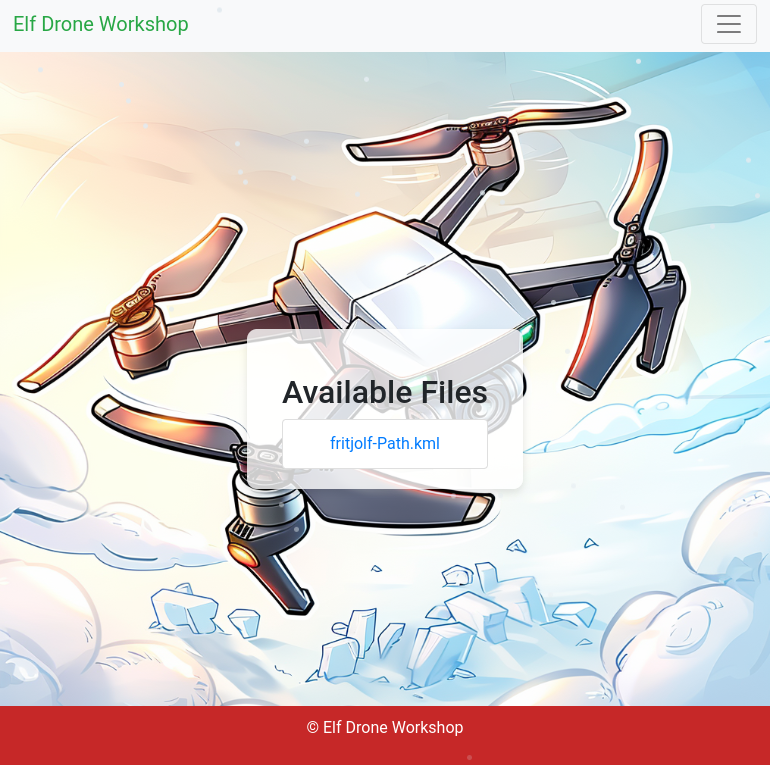
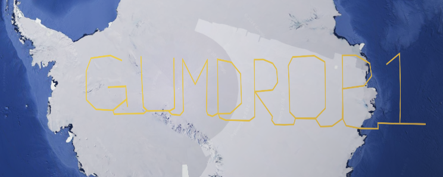
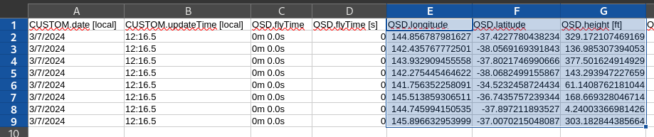
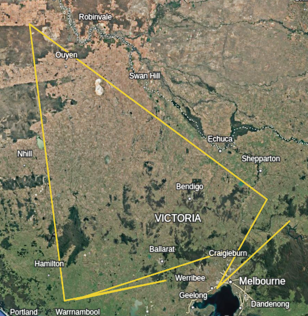
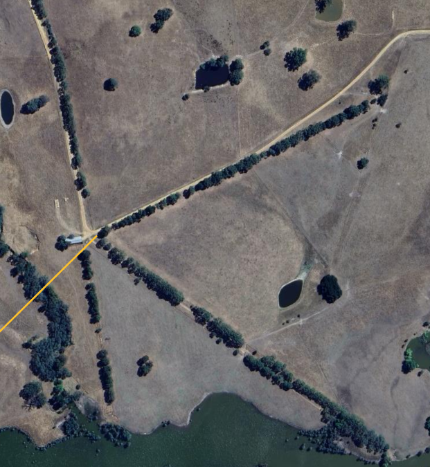
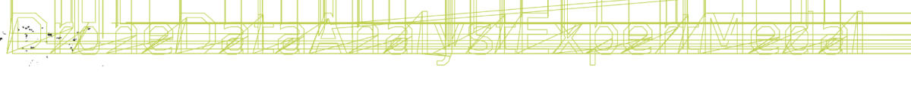
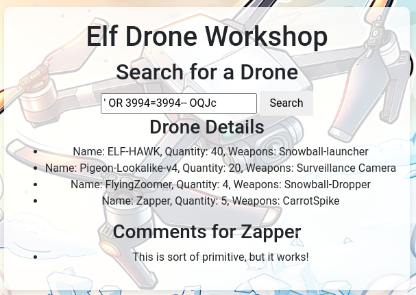

# Drone Path

Difficulty: :material-star::material-star::material-star::material-star-outline::material-star-outline:

## Objective

!!! question "Task description"

    Help the elf defecting from Team Wombley get invaluable, top secret intel to Team Alabaster. Find Chimney Scissorsticks, who is hiding inside the DMZ.

??? quote "Chimney Scissorsticks"

    Hey. Psst, over here. Hey, I'm Chimney Scissorsticks.

    I'm not liking all the tension brewing between the factions, so even though I agreed with how Wombley was handling things, I get the feeling this is going to end poorly for everyone. So I'm trying to get this data to Alabaster's side. Can you help?

    Wombley's planning something BIG in that toy factory. He's not really making toys in there. He's building an armada of drones!

    They're packed with valuable data from the elves working on the project. I think they {==hide the admin password in the drone flight logs==}. We need to crack this to prevent this escalating snowball showdown.

    You'll be working with KML files, tracking drone flight paths. Intriguing, right? We need every detail to prepare for what’s ahead!

    {==Use tools like Google Earth and some Python scripting==} to decode the {==hidden passwords and codewords==} locked in those files.

    Ready to give it a go? It’s going to be a wild ride, and your skills might just turn the tide of this conflict!

## Hints

There are no hints available.

## Solution

=== "Silver"

    The terminal gives us a web application. The is login functionality and a fileshare that provides us a .kml file. Even though there are no hints available, the chat with Chimney contains some. We can open this type of file in Google Earth and need to find hidden codes inside it.

    {width=500}
    /// caption
    Available .kml file on the web application.
    ///

    When we open this file in Google Earth and look above the North Pole we see the text "GUMDROP1" as a drawn drone path.

    {width=500}
    /// caption
    Code in the .kml file.
    ///

    Going back to the web application, we can then login using these credentials:

    ```
    Username: fritjolf
    Password: GUMDROP1
    ```

    We now have access to some additional pages:

    - A profile page with some user info.
    - Elf drone workshop that can display drone details when provided a drone name.
    - Admin console that needs a code to access.

    On the profile page we see this text:

    `Note to self, remember drone name, it is the same location as secret snowball warehouses /files/secret/Preparations-drone-name.csv`

    The path links to [this](https://hhc24-dronepath.holidayhackchallenge.com/files/secret/Preparations-drone-name.csv) page where we receive a .csv file. This .csv seems to contain some coordinate mapping in addition to a bunch of other columns. We focus on the coordinates (longtitude, latitude, height).

    
    /// caption
    Coordinates contained in .csv file.
    ///

    We want to create a new .kml file that contains these coordinates:

    ??? example "AI usage"

        ChatGPT was used to generate a new file .kml file with these coordinates. It was provided the set and the original .kml file, and asked to replace the values. It was also asked to change the 'lookat' value to something nearby these coordinates for easy viewing.

    ??? note "New .kml file"

        ``` xml linenums="1"
        <?xml version="1.0" encoding="UTF-8"?>
        <kml xmlns="http://www.opengis.net/kml/2.2" xmlns:gx="http://www.google.com/kml/ext/2.2" xmlns:kml="http://www.opengis.net/kml/2.2" xmlns:atom="http://www.w3.org/2005/Atom">
        <Document>
            <name>fritjolf-Path</name>
            <gx:CascadingStyle kml:id="__managed_style_2398E937F13251C4AAA6">
                <Style>
                    <IconStyle>
                        <scale>1.2</scale>
                        <Icon>
                            <href>https://earth.google.com/earth/rpc/cc/icon?color=1976d2&amp;id=2000&amp;scale=4</href>
                        </Icon>
                        <hotSpot x="64" y="128" xunits="pixels" yunits="insetPixels"/>
                    </IconStyle>
                    <LabelStyle>
                    </LabelStyle>
                    <LineStyle>
                        <color>ff2dc0fb</color>
                        <width>6</width>
                    </LineStyle>
                    <PolyStyle>
                        <color>40ffffff</color>
                    </PolyStyle>
                    <BalloonStyle>
                        <displayMode>hide</displayMode>
                    </BalloonStyle>
                </Style>
            </gx:CascadingStyle>
            <gx:CascadingStyle kml:id="__managed_style_177256F1433251C4AAA6">
                <Style>
                    <IconStyle>
                        <Icon>
                            <href>https://earth.google.com/earth/rpc/cc/icon?color=1976d2&amp;id=2000&amp;scale=4</href>
                        </Icon>
                        <hotSpot x="64" y="128" xunits="pixels" yunits="insetPixels"/>
                    </IconStyle>
                    <LabelStyle>
                    </LabelStyle>
                    <LineStyle>
                        <color>ff2dc0fb</color>
                        <width>4</width>
                    </LineStyle>
                    <PolyStyle>
                        <color>40ffffff</color>
                    </PolyStyle>
                    <BalloonStyle>
                        <displayMode>hide</displayMode>
                    </BalloonStyle>
                </Style>
            </gx:CascadingStyle>
            <StyleMap id="__managed_style_08C7CAFB983251C4AAA6">
                <Pair>
                    <key>normal</key>
                    <styleUrl>#__managed_style_177256F1433251C4AAA6</styleUrl>
                </Pair>
                <Pair>
                    <key>highlight</key>
                    <styleUrl>#__managed_style_2398E937F13251C4AAA6</styleUrl>
                </Pair>
            </StyleMap>
            <Placemark id="06AEB73AFD323DB38AEB">
                <name>fritjolf-Path</name>
                <LookAt>
                    <longitude>144.8567879816271</longitude>
                    <latitude>-37.42277804382341</latitude>
                    <altitude>500</altitude>
                    <heading>0</heading>
                    <tilt>45</tilt>
                    <gx:fovy>35</gx:fovy>
                    <range>1000</range>
                    <altitudeMode>absolute</altitudeMode>
                </LookAt>
                <styleUrl>#__managed_style_08C7CAFB983251C4AAA6</styleUrl>
                <LineString>
                    <coordinates>
                        144.8567879816271,-37.42277804382341,100  <!-- Altitude: 100 -->
                        142.4357677725014,-38.0569169391843,200  <!-- Altitude: 200 -->
                        143.9329094555584,-37.80217469906655,150  <!-- Altitude: 150 -->
                        142.2754454646221,-38.0682499155867,250  <!-- Altitude: 250 -->
                        141.756352258091,-34.52324587244343,300  <!-- Altitude: 300 -->
                        145.513859306511,-36.74357572393437,350  <!-- Altitude: 350 -->
                        144.745994150535,-37.89721189352699,400  <!-- Altitude: 400 -->
                        145.8966329539992,-37.00702150480869,450  <!-- Altitude: 450 -->
                    </coordinates>
                </LineString>
            </Placemark>
        </Document>
        </kml>
        ```

    We open this file in Google Earth and see the following:

    
    /// caption
    New path.
    ///

    Zooming in on the points, it appears they represent letters in a very creative way:

    
    /// caption
    The letter 'K' encoded in aligned trees.
    ///

    Looking at all the points, we get the following code: ```ELF-HAWK```. This seems to be a drone name and we can get more details using the drone workshop on the web app:

    ```
    Drone Details
    Name: ELF-HAWK, Quantity: 40, Weapons: Snowball-launcher

    Comments for ELF-HAWK
    These drones will work great to find Alabasters snowball warehouses. I have hid the activation code in the dataset ELF-HAWK-dump.csv. We need to keep it safe, for now it's under /files/secret.
    We need to make sure we have enough of these drones ready for the upcoming operation. Well done on hiding the activation code in the dataset. If anyone finds it, it will take them a LONG time or forever to carve the data out, preferably the LATTER.
    ```

    We need to find another code in the dataset we are [linked](https://hhc24-dronepath.holidayhackchallenge.com/files/secret/ELF-HAWK-dump.csv) to. This .csv file is similar as the previous one but has many more rows (~3k). This time we'll need a script to generate a .kml file.

    ??? example "AI usage"

        We prompted ChatGPT to create a script to generate a .kml file from a set of coordinates, based on the previous .kml file it generated for us.

    ??? note "Script to generate .kml file"

        ``` python linenums="1"
        import xml.etree.ElementTree as ET

        # Function to generate KML from coordinates and altitudes
        def generate_kml(coordinates, output_file='output.kml'):
            # Create the KML structure
            kml_ns = {"kml": "http://www.opengis.net/kml/2.2", "gx": "http://www.google.com/kml/ext/2.2"}
            kml = ET.Element("kml", xmlns="http://www.opengis.net/kml/2.2", xmlns_gx="http://www.google.com/kml/ext/2.2")
            document = ET.SubElement(kml, "Document")

            # Add name and styles
            name = ET.SubElement(document, "name")
            name.text = "fritjolf-Path"

            # LookAt element (can be adjusted based on desired viewpoint)
            look_at = ET.SubElement(document, "LookAt")
            ET.SubElement(look_at, "longitude").text = str(coordinates[0][0])  # Using first longitude
            ET.SubElement(look_at, "latitude").text = str(coordinates[0][1])   # Using first latitude
            ET.SubElement(look_at, "altitude").text = "500"  # Adjust this value as needed
            ET.SubElement(look_at, "heading").text = "0"
            ET.SubElement(look_at, "tilt").text = "45"
            ET.SubElement(look_at, "gx:fovy").text = "35"
            ET.SubElement(look_at, "range").text = "1000"
            ET.SubElement(look_at, "altitudeMode").text = "absolute"

            # Placemark for the path
            placemark = ET.SubElement(document, "Placemark")
            ET.SubElement(placemark, "name").text = "fritjolf-Path"
            ET.SubElement(placemark, "styleUrl").text = "#__managed_style_08C7CAFB983251C4AAA6"

            # LineString to define the path with coordinates and altitudes
            line_string = ET.SubElement(placemark, "LineString")
            coordinates_elem = ET.SubElement(line_string, "coordinates")

            # Add each coordinate pair with altitude
            for coord in coordinates:
                # Each coordinate is in the form (longitude, latitude, altitude)
                coord_str = f"{coord[0]},{coord[1]},{coord[2]}"
                coordinates_elem.text = (coordinates_elem.text or '') + coord_str + " "

            # Write the KML to a file
            tree = ET.ElementTree(kml)
            with open(output_file, "wb") as f:
                tree.write(f)

        # Example usage
        # Your list of coordinates: [(longitude, latitude, altitude), ...]
        coordinates = [
            INSERT COORDINATES
        ]

        # Generate the KML file
        generate_kml(coordinates, 'path_with_altitude.kml')
        ```

    This time, the generated .kml file doesn't correctly show us a code in Google Earth. We try to use some other websites but they all fail to show the complete word. When we use the open-source [QGIS](https://www.qgis.org/) cartography app, we get better results:

    
    /// caption
    The encoded word shows up in QGIS.
    ///

    !!! success "Answer"

        The admin code and answer is ```DroneDataAnalystExpertMedal```

    ??? quote "Chimney Scissorsticks"

        Bravo! You've tackled the drone challenge and navigated through those KML files like a true expert. Your skills are just what we need to prevent the big snowball battle—the North Pole thanks you!

        Well done! You cracked the code from the drones and showed you've mastered the basics of KML files. This kind of expertise will be invaluable as we gear up for what’s ahead!

        But I need you to dig deeper. Make sure you’re {==checking those file structures==} carefully, and remember—rumor has it there is {==some injection flaw==} that might just give you the upper hand. Keep your eyes sharp!

=== "Gold"

    Chimney shared some additional information about a possible SQL injection flaw being present on the web application. It seems like the drone workshop input field is not throttled. We use sqlmap and find the following SQL injection:

    
    /// caption
    SQL injection giving us all available drones in the workshop.
    ///

    The page for ```Pigeon-Lookalike-v4``` has some interesting details:

    ```There was some talk about only TRUE carvers would find secrets and that FALSE ones would never find it.```

    This seems to be another hint. We go back to our most recent .csv file as there many columns that contain TRUE/FALSE as values. They seem to alternate quite a lot between the rows. This could be encoded data. We do the following:

    - We remove all columns that are not representing a boolean value.
    - We replace all TRUE with 1, and FALSE with 0.
    - We copy the data and make sure to clean it properly in a text editor.
    - We use CyberChef to convert it with the recipe 'from binary'.

    We then get ASCII art that contains the code, how creative!

    ??? note "ASCII art"

        ```
        :::::::::::::::::::::::::::::::::::::::::::::::::::::::::::::::::::::::::::::::::::::::::
        :::::::::::::::::::::::::::::::::::::::::::::::::::::::::::::::::::::::::::::::::::::::::
        :::::::::::::::::::::::::::::::::::::::::::::::::::::::::::::::::::::::::::::::::::::::::
        ::::::::::::::::::::::::::::::::::::::::::::::::::::::::::::::::::::::*::::::::::::::::::
        :::::::::::::::::::::::::::::::-------------=--------::::::::::::::::::::::::::::::::::::
        ::::::::::::::::::::::------------------------===-=======--=-::::::::::-:::::::::::::::::
        ::::::::::::::::::::------------:------------=-====================---:::::::::=+::::::::
        :::::::::::::::::------------------------------=====================-------::::::::::::::
        ::::::::::::::-------------------------------------================:------:::::::::::::::
        ::::::::::::--------------------------------------==============-::--------:::::::::-::::
        ::::::::::::-------:--------@+:::::::::--=@--------:===========-::-::----==---:::::::::::
        ::::-------:::::----------@---::::::---+-==+@--------=========-:--:------=====---::::::::
        ::::--------::::::-------#--------------=-+@------------===------::-----====--==---::::::
        ::::-------:-:::::::------@=@=++#+++++@@@@@=-----------------:::--------------==---::::::
        ::::----------::::=-#-:----**%@+++++++%@@=::::::---%@------:--------:--@-+::-------::::::
        ::::-----:----:::::::::::--::@@**%@--::::::::::::::--=+@------------@--:::::------@::::::
        ::::---+@::::::---+@:::::::::#@-@--:::::-:=*=-::-----=+*=*=--------@:--:::::::-----=:::::
        ::::@-:::-::::::-----=@:-:::@+@%---------------==-==+@@@@@=@------@---------:::::--==+%::
        :::#:::::::::::-----=+*@:::%#@#-=---------===++*%@@+@=+*#-+*=@-----#====-----------**-%::
        ::@--::-:::--:---==++*@-:@=+@=+-@=*+++++++**@#%*@-##**-@##%=#%@@@@#*@###@=+**@*****@@@:::
        :::@*=--++++++++**@@@@@@*#@-+%@*=*+****@@@+@***@%@@%%%@-%@*@@@@@@@@@@@@@@%%#%%%@@@@@%::::
        :::@@@@@@@++#*####@@@@@@@==---====+##@*%=+@*@*%%@@@@@@@@@@@@@@@=--@+@@@@+@@@@@@@@@@-:::::
        ::::=*%%%%%%%%%%%@@%@@#@-#*+++++====@-++###@%@*@@@@+@@@@-**+--::::--@@%@%%@%%%%%@@@-:::::
        ::::---@@@@##@@@@@@@@@--+@%-#+#**+=+++**%@@@@@@@##%**%--:::::::--*----=*@@@@@@@*@@---::::
        ::::---@@***%%%%@@@@*@-=-+=@#=#%##***##@@@@@#@@*@%%==---:::::::::::----=+---------=--::::
        ::::----@+=%#@@@=@@-----##@+:-=%@@%##%@@@@@@@@@@@@*+=-----::::::::::::=+*-@:----===--::::
        ::::---------------------*@##=+@@%@==-+@@@@@@@@@@@-+=---------------===+**--=======-:::::
        :::---------------:------%+#%@@@@@#%%%%@@@@#@@@@@@@-+======---------==***#@========-:::::
        :::-%-%---------:---------*-*##%@@@@@@@@@@@@@@@@@--=@@-*===++++++++++***@*===++++++=-::::
        :::--+---------=-------:-----#==#@%%%@@@@@*@%@@@----@+@@@=***@@@@***@@@@%===++++-++=-::::
        :::--------------:::::--------------##-----@@--------@%@#@@%%%%@@@@@@#@=====+++++++=-::::
        :::---------------::::::---------------------=====---@@##@@@@@@@@@@@#%#-=====+++++--:::::
        :::---======-------------------------=----==========--*=@@%@++*@@%%%@@-======:----==-::::
        :::---===============------------------===============-----#@@@@@-----===-::---=====-::::
        :::--=============+===--------------===-==================--------======::----=======-:::
        :::--================---::::-=======-======================+=====+====::------===+===-:::
        :::--===================--:::::====================+====-:---==+++=::-----=======---=-:::
        :::--========:===========------:=====================:::-----====:-----==========+===-:::
        / ___/ _ \|  _ \| ____\ \      / / _ \|  _ \|  _ \   _____  ====:-----==========+===-:::
        | |  | | | | | | |  _|  \ \ /\ / / | | | |_) | | | | |_____| ====:-----==========+===-:::
        | |__| |_| | |_| | |___  \ V  V /| |_| |  _ <| |_| | |_____| ====:-----==========+===-:::
        \____\___/|____/|_____|__\_/\_/__\___/|_| \_\____/  _  _________   ______    _    ____
        | ____\ \/ /  _ \| ____|  _ \_   _|_   _| | | |  _ \| |/ / ____\ \ / / ___|  / \  |  _ \
        |  _|  \  /| |_) |  _| | |_) || |   | | | | | | |_) | ' /|  _|  \ V / |     / _ \ | |_) |
        | |___ /  \|  __/| |___|  _ < | |   | | | |_| |  _ <| . \| |___  | || |___ / ___ \|  _ <
        |_____/_/\_\_| __|_____|_|_\_\|_| __|_|  \___/|_| \_\_|\_\_____| |_| \____/_/   \_\_| \_\
        \ \   / / ____|  _ \|  \/  | ____|  _ \  / \  | |    ==========---======++++=+=--+++=-:::
        \ \ / /|  _| | |_) | |\/| |  _| | | | |/ _ \ | |    ==========---======++++=+=--+++=-:::
        \ V / | |___|  _ <| |  | | |___| |_| / ___ \| |___ ==========---======++++=+=--+++=-:::
        \_/  |_____|_| \_\_|  |_|_____|____/_/   \_\_____|==========---======++++=+=--+++=-:::
        ::::--====+++=---++++++=+========------::::=-:---==============---======++++=+=--+++=-:::
        ::::--==+++++++==---+++++++++++========-----================++++==-========-++=++====-:::
        :::::--====+++++-++--++++++++++=--------=-==============+++---------=====++=+++++::::::::
        ::::::::======+++=+++=+++++++++++++++=++++===========++++:-------=---=-=----:::::::::::::
        ::::::::::::::::--=-=======++=++++++++++++++============--------------:::::::::::::::::::
        :::::::::::::::::::::::::::------===-==-===-==-----::-:::::::::::::::::::::::::::::::::::
        :::::::::::::::::::::::::::::::::::::::::::::::::::::::::::::::::::::::::::::::::::::::::
        :::::::::::::::::::::::::::::::::::::::::::::::::::::::::::::::::::::::::::::::::::::::::
        ```
    !!! success "Answer"

        Answer is ```EXPERTTURKEYCARVERMEDAL```

## Response

??? quote "Chimney Scissorsticks"

    Absolutely fantastic! I think you found the most difficult path in, from file carving to SQL injection. Not many can do that, but you've shown you’re ready for anything the factions throw your way!
