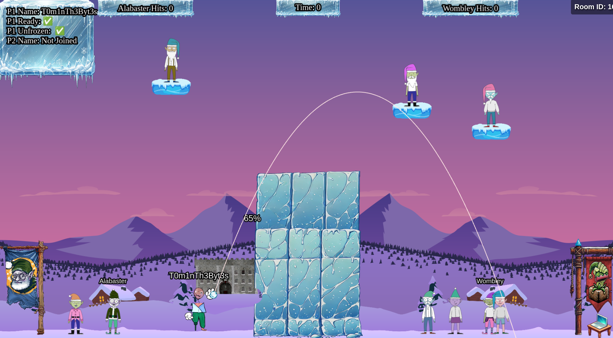
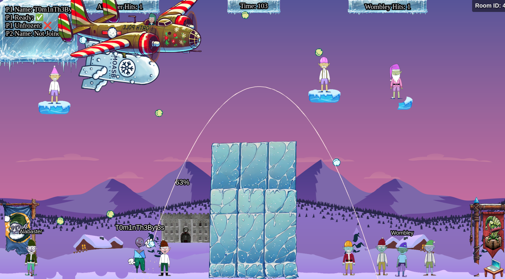

# Snowball Showdown

Difficulty: :material-star::material-star::material-star-outline::material-star-outline::material-star-outline:

## Objective

!!! question "Task description"

    Wombley has recruited many elves to his side for the great snowball fight we are about to wage. Please help us defeat him by hitting him with more snowballs than he does to us.

??? quote "Dusty Giftwrap"

    Hi there! I'm Dusty Giftwrap, back from the battlefield! I'm mostly here for the snowball fights!

    But I also don't want Santa angry at us, you wouldn't like him when he's angry. His face becomes as red as his hat! So I guess I'm rooting for Alabaster.

    Alabaster Snowball seems to be having quite a pickle with Wombley Cube. We need your wizardry.

    Take down Wombley {==the usual way==} with a friend, or try a different strategy by {==tweaking client-side values==} for an extra edge.

    Alternatively, we've got a {==secret weapon - a giant snow bomb==} - but we can't remember where we put it or how to launch it.

    Adjust the right elements and victory for Alabaster can be secured with more subtlety. Intriguing, right?

    Raring to go? Terrific! Here's a real brain tickler. Navigator of chaos or maestro of subtlety, which will you be? Either way, remember our objective: bring victory to Alabaster.

    Confidence! Wit! We've got what it takes. Team up with a friend or find a way to go solo - no matter how, let's end this conflict and take down Wombley!

## Hints

There are no hints available.

## Solution

=== "Silver"

    This is another minigame challenge. We need to throw snowballs at Wombley in game designed to be played as co-op:

    
    /// caption
    The Snowball Showdown minigame.
    ///

    The simple way to win this game is to look for another player to play with and win. However, you can also play solo by changing the URL parameter 'singlePlayer' when in a private room:

    `https://hhc24-snowballshowdown.holidayhackchallenge.com/game.html?username=T0m1nTh3Byt3s&roomId=48b3a5b5&roomType=private&id=9cac813f-cb6e-4fa9-bf43-233bcc69c48c&dna=ATATATTAATATATATATATTAGCATATATATTACGATATATATATATATATATTAATATATATATATATCGATATTACGATATATATATATGCCGATATATATATATTATAATATCGGC&singlePlayer=true`

    You can also make your life easier by altering some game parameters(1), such as the blast radius of the snowballs:
    { .annotate }

    1. Besides looking at the game code, we can quickly identity variables to check with this JavaScript code we can paste in the DevTools console:
    ```for(var b in window) {if(window.hasOwnProperty(b)) console.log(b);}```

    ```mainScene.snowBallBlastRadius = 10000```

    The game will recognize this as cheating with a pop-up on the bottom of the screen but you can still get the achievement.

    !!! success "Answer"

        Change the URL parameter ```singlePlayer``` to true and win the game (possibly by editing game parameters to help you cheat).

=== "Gold"

    In game code we see the following snippet:

    ``` js title="Code snippet in 'phaser-snowball-game.js'"
    this.moasb = () => { this.ws.sendMessage({ type: 'moasb' }) }
    ```

    'MOASB' sounds like 'MOAB', also known as 'Mother of All Bombs'. As we throw with snowballs, it might allude to 'Mother of All Snowballs'. We can call this function during a match:

    ```mainScene.moasb()```

    A plane will appear that drops the MOASB! This is too cool not to show a screenshot of:

    
    /// caption
    The MOASB in action!
    ///

    !!! success "Answer"

        Drop a MOASB by putting ```mainScene.moasb()``` in the console during a match.

## Response

??? quote "Dusty Giftwrap"

    Fantastic work! You've used your hacker skills to lead Alabaster’s forces to victory. That was some impressive strategy!

    Christmas is on the line! For a mischievous edge-up, dive into the game’s code - a few client-side tweaks to speed, movement, or power might shift the balance… or just help us find that secret weapon we misplaced!

    Excellent! With Wombley’s forces defeated, they’ll have no choice but to admit defeat and abandon their wild plans to hijack Christmas.
