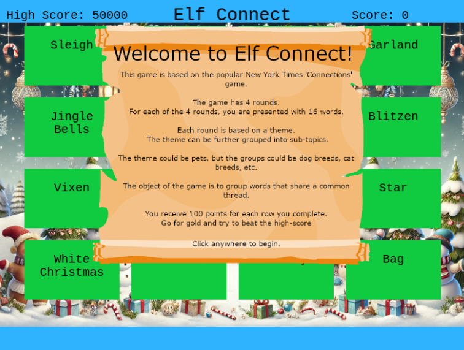

# Elf Connect

Difficulty: :material-star::material-star-outline::material-star-outline::material-star-outline::material-star-outline:

## Objective

!!! question "Task description"

    Help Angel Candysalt connect the dots in a game of connections.

??? quote "Angel Candysalt"

    Welcome back, island adventurer! I'm Angel Candysalt — so happy to finally meet you!

    I'm thrilled you're here because I could really use a hand with something.

    Have you ever heard of a game called Connections?

    It’s simple! All you need to do is {==find groups of four related words==}.

    I've been stuck on it all day, and I'm sure someone as sharp as you will breeze through it.

    Oh, and while you're at it, {==check out randomElf's score — they hit fifty thousand points, which seems… oddly suspicious==}.

    Think they might {==have tampered with the game?==} Just a hunch!

## Hints

??? tip "Easy"

    I love brain games! This one is like the New York Times Connections game. Your goal here is to {==find groups of items that share something in common==}. Think of each group as having a hidden connection or theme—four items belong together, and there are multiple groups to find! See if you can spot {==patterns or common threads==} to make connections. Group all the items correctly to win!

??? tip "Hard"

    WOW! A high score of 50,000 points! That’s way beyond the limit! With only four rounds and a max of 400 points per round, the {==top possible score should be 1,600 points==}. So, how did someone get to 50,000? Something unusual must be happening!

    If you're curious, you might want to {==check under the hood==}. Try opening the {==browser's developer tools console==} and looking around—there might even be a {==variable named 'score'==} that could give you some insights. Sometimes, games hold secrets for those who dig a little deeper. Give it a shot and see what you can discover!

## Answer

=== "Silver"

    When interacting with the terminal we get presented a minigame. As said by Angel, the game is called 'Connections', where we get sixteen words and we need to find four groups that belong together per round.

    Not being a native English speaker, the first round is actually quite challenging. Fortunately, impatience actually rewards us here as prematurely checking the browser's develop tools quickly gives us insight into the answers when looking at scripts embedded in the HTML:

    ```
    const wordSets = {
        1: ["Tinsel", "Sleigh", "Belafonte", "Bag", "Comet", "Garland", "Jingle Bells", "Mittens", "Vixen", "Gifts", "Star", "Crosby", "White Christmas", "Prancer", "Lights", "Blitzen"],
        2: ["Nmap", "burp", "Frida", "OWASP Zap", "Metasploit", "netcat", "Cycript", "Nikto", "Cobalt Strike", "wfuzz", "Wireshark", "AppMon", "apktool", "HAVOC", "Nessus", "Empire"],
        3: ["AES", "WEP", "Symmetric", "WPA2", "Caesar", "RSA", "Asymmetric", "TKIP", "One-time Pad", "LEAP", "Blowfish", "hash", "hybrid", "Ottendorf", "3DES", "Scytale"],
        4: ["IGMP", "TLS", "Ethernet", "SSL", "HTTP", "IPX", "PPP", "IPSec", "FTP", "SSH", "IP", "IEEE 802.11", "ARP", "SMTP", "ICMP", "DNS"]
    };
    ...
    let correctSets = [
        [0, 5, 10, 14], // Set 1
        [1, 3, 7, 9],   // Set 2
        [2, 6, 11, 12], // Set 3
        [4, 8, 13, 15]  // Set 4
    ];
    ```

    The correct sets for all rounds are fixed by the index of the words. Parsing this data, we get the following correct sets:

    - Round 1
        * Tinsel, Garland, Star, Lights
        * Sleigh, Bag, Mittens, Gifts
        * Belafonte, Jingle Bells, White Christmas, Crosby
        * Comet, Vixen, Crosby, Prancer
    - Round 2
        * Nmap, netcat, Wireshark, Nessus
        * burp, OWASP Zap, Nikto, wfuzz
        * Frida, Cycript, AppMon, apktool
        * Metasploit, Cobalt Strike, HAVOC, Empire
    - Round 3
        * AES, RSA, Blowfish, 3DES
        * WEP, WPA2, TKIP, LEAP
        * Symmetric, Asymmetric, hash, hybrid
        * Caesar, One-time Pad, Ottendorf, Scytale
    -  Round 4
        * IGMP, IPX, IP, ICMP
        * TLS, SSL, IPSec, SSH
        * Ethernet, PPP, IEEE 802.11, ARP
        * HTTP, FTP, SMTP, DNS

    !!! success "Answer"

        Solving the game the way it is meant to be played will give us the silver achievement.

=== "Gold"

    The hint suggests that we need to use the browser's developer tools console to solve this challenge. When looking through the HTML and JavaScript code, we see that the variable ```score``` is used to keep track of the current score (use ++ctrl+f++ for quick searching). We check for ```score``` in the console and can set it to a number higher than the high score[^1], such as ```score = 424242```.

    To now trigger the win, we need to make the game check a set. We use one of the sets found in the silver part of the challenge and submit it to let the game compute the new (high)score, and get the gold achievement.

    [^1]: It seems like the ```score``` variable is not initialized right from the beginning and you need to browse the HTML code to get it to be acknowledged by the console. This could be caused by optimizations in Chrome.

### Images



## Response

??? quote "Angel Candysalt"

    Amazing! You really connected all the dots like a pro.
