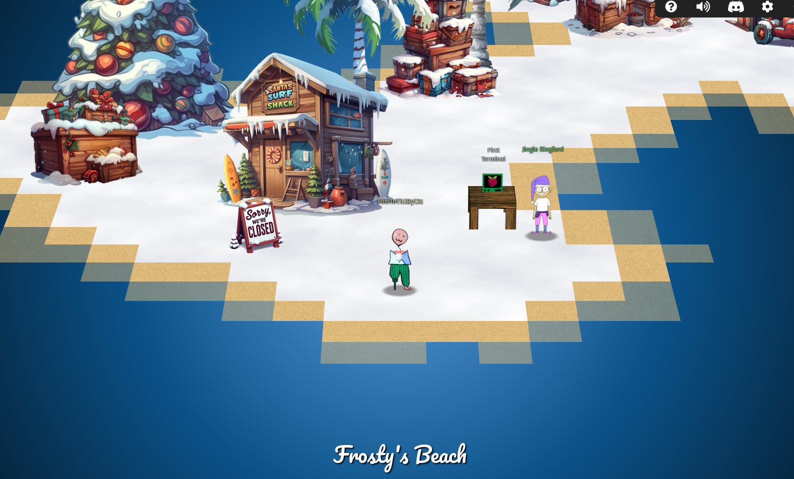
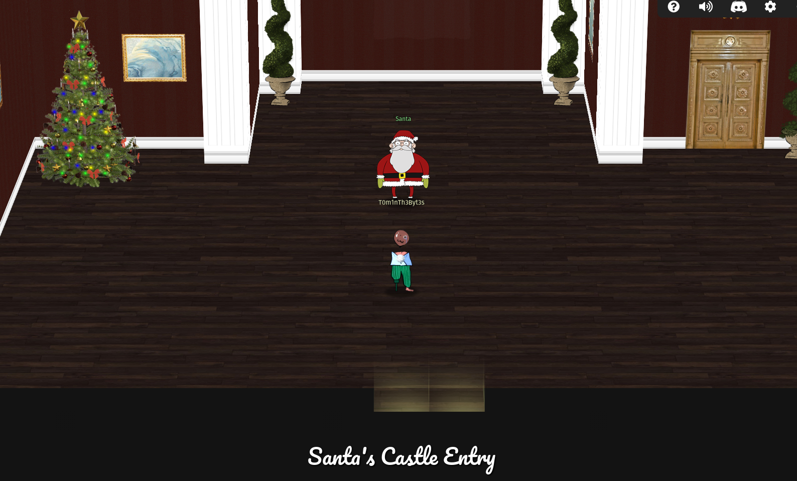

# SANS Holiday Hack Challenge 2024 Write-Up

This is a complete write-up for the [SANS Holiday Hack Challenge 2024](https://www.sans.org/mlp/holiday-hack-challenge-2024/). This is a yearly capture-the-flag event organized by the SANS training institute around the holiday period. It is free of charge and played in form of an online multiplayer rpg-like game including a world to walk around freely in where you can meet your peers, NPCs with dialogue, and a storyline, making it a unique CTF.

!!! tip "Submission results"

    My entry was selected as one of the 'Super Honorable Mentions' for 2024! More details can be found [here](https://www.sans.org/cyber-ranges/holiday-hack-challenge/winners-and-answers).


/// caption
Multiplayer world to roam around in.
///

## Challenge topics 2024

- Ransomware Reverse Engineering
- Hardware Hacking
- Web App Hacking with MQTT and Video Feed Manipulation
- Video Game Hacking
- Threat Hunting with KQL
- SIM/SEM Analysis
- Mobile App Penetration Testing
- OSINT via Drone Path Analysis
- Web Exploration with cURL
- PowerShell for Cyber Defense

## Personal note

This is the first time I have written a write-up for a CTF, and the second time completing the SANS Holiday Hack Challenge after tackling it in 2022. I have thoroughly enjoyed the creativity and effort put into each challenge and highly appreciate this being available for free. I also want to shoutout the awesome community on Discord that supported me with nudges when I needed them the most!

Besides practicing my CTF skills, this write-up has also allowed me to gain experience with Github pages and MKDocs Material, two technologies that I have been wanting to experiment with. I have also opted to test ChatGPT more in depth using their premium offering for a month and learn more about writing effective prompts (more information below). All-in-all, this has been a pleasure to work on!

## Write-up information

I have attempted to extract the maximum value of MKDocs Material during writing. You will see structured pages following a consistent design language. Some special features have been used for better readability and clarity:

### Admonitions

These have been of great help to call-out side content without interrupting the document flow. You will see various types, with some being collapsed by default.

!!! note "Note"

    Simple note highlighting some information.

!!! question "Objective"

    Objectives will be shown in a question box.

!!! tip "Hint"

    Hints provided by the CTF will be shown in a tip box. They will include {==highlighted text==} to show what part of the hint triggers me as 'important'.

!!! quote "Conversation"

    Character conversations will be shown in a quote box. They will include {==highlighted text==} to show what part of the conversation triggers me as 'important'.

!!! success "Answer"

    Final challenge answers will be given in an answer box.

!!! example "AI usage"

    All usage of AI will be highlighted using a special call-out box with the aim to create a better understanding of how it has contributed to the result.

### Answer structure

SANS has added a silver and a gold achievement for every challenge to make it possible to progress in the story without having to complete every challenge on the hardest level (gold). To make a distinction between these versions of the challenge in the write-up, the solutions have tabs to separate the answers:

=== "Silver"

    Solution for the silver achievement.

=== "Gold"

    Solution for the gold achievement.

### Code blocks

```python title="Code blocks" linenums="1" hl_lines="2"
Where possible, code blocks will be used to clearly denote code, commands, or other challenge artifacts.
When there are lines that are of importance, they will be highlighted like this one.
When there is more to share, annotations will be used, like here. # (1)!
```

1. They will contain more information.

## Conclusion with Santa

!!! quote "Santa"

    I thought the holidays were truly lost this year. I am so thankful you were here to right the wrongs of my misguided elves. I will ensure they never jeopardize the holidays again. This is the kind of behavior I expect from Jack Frost and his Trolls, not the elves.

    But, I suppose I have fault in this as well, since it's the first time I've been away at the start of the season, and after last year's unconventional holidays.

    Plus, I didn't inform the elves ahead of time. Quite the lesson learned on my part. Even the best of us can always improve.

    I know each faction had the best interest of the holidays at heart, even if their methods were misguided. It's important to have empathy and forgiveness, especially during the holidays.

    After all, the greatest gift we give AND receive is time spent with loved ones. Never forget that!

    Now let's put all this behind us and be merry. Until next year! Happy Holidays!


