# Elf Minder 9000

Difficulty: :material-star::material-star-outline::material-star-outline::material-star-outline::material-star-outline:

## Objective

!!! question "Task description"

    Assist Poinsettia McMittens with playing a game of Elf Minder 9000.

??? quote "Poinsettia McMittens"

    Center your mind, and become one with the island!

    Relax...

    This isn't working! I'm trying to play this game but the whole "moving back to the North Pole" thing completely threw me off.

    Say, how about you give it a try. It's really simple. All you need to do is {==help the elf get to the exit==}.

    {==The faster you get there, the better your score!==}

    I've run into some {==weirdness with the springs==} though. If I had created this game it would've been a lot more stable, but I won't {==comment==} on that any further.

## Hints

??? tip "Reusable Paths"

    Some levels will require you to {==click and rotate paths==} in order for your elf to collect all the crates.

??? tip "TODO"

    When developing a video game—even a simple one—it's surprisingly easy to {==overlook an edge case in the game logic==}, which can lead to {==unexpected behavior==}.

??? tip "RTD (Read the Docs)"

    Be sure you {==read the "Help" section thoroughly!==} In doing so, you will learn how to use the tools necessary to safely guide your elf and collect all the crates.

## Solution

=== "Silver"

    This challenge presents us with another minigame to play. Since we were awarded the silver achievement after playing the game normally last time, we assume that we have to do something similar again. The conversation with Poinsettia also indicates this. The game presents us various levels where we need to draw a path that collects all the crates and reaches the finish mark before running out of time. Looking at the hints, it seems like we can rotate paths when clicking on them and the 'Help' section is important to study.

    Poinsettia says a higher score is better but it is not a requirement to complete the game. There also seems to be some weirdness with the spring entities, possibly described in a comment in the code.

    For the silver solution, we will play the game as intended and not focus on the scores. Note that clicking a non-occupied path while the elf is walking will rotate it. We need to use this to complete many of the levels.

    ??? success "Solution for 'Sandy Start'"

        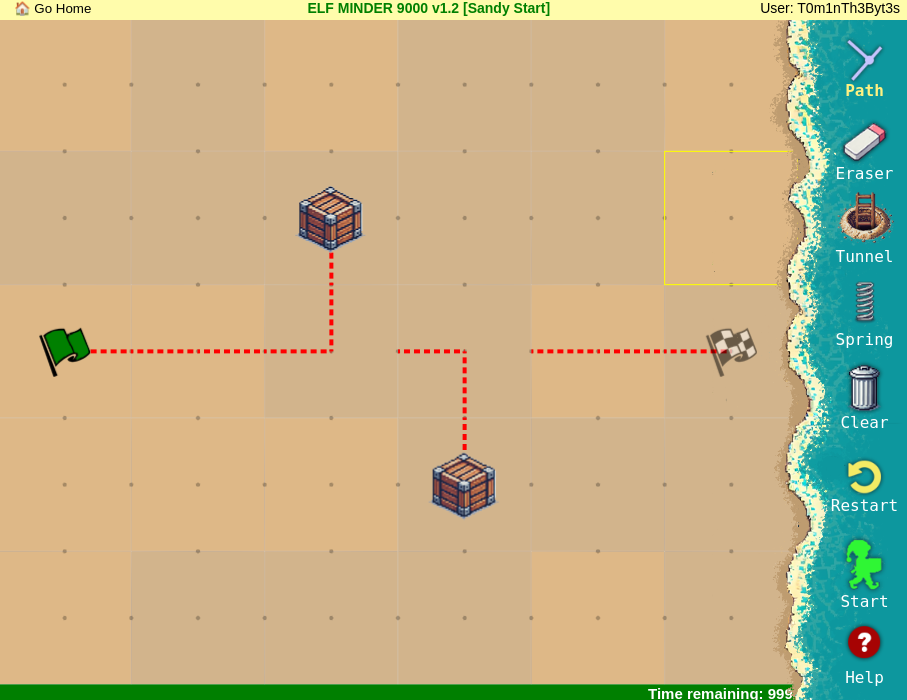

    ??? success "Solution for 'Waves and Crates'"

        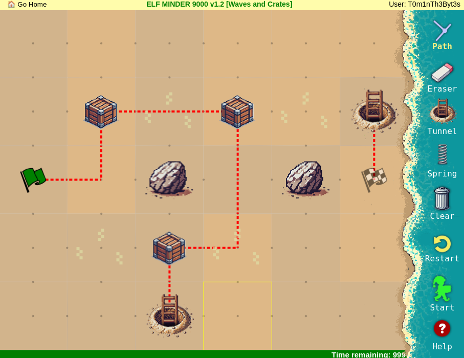

    ??? success "Solution for 'Tidal Treasures'"

        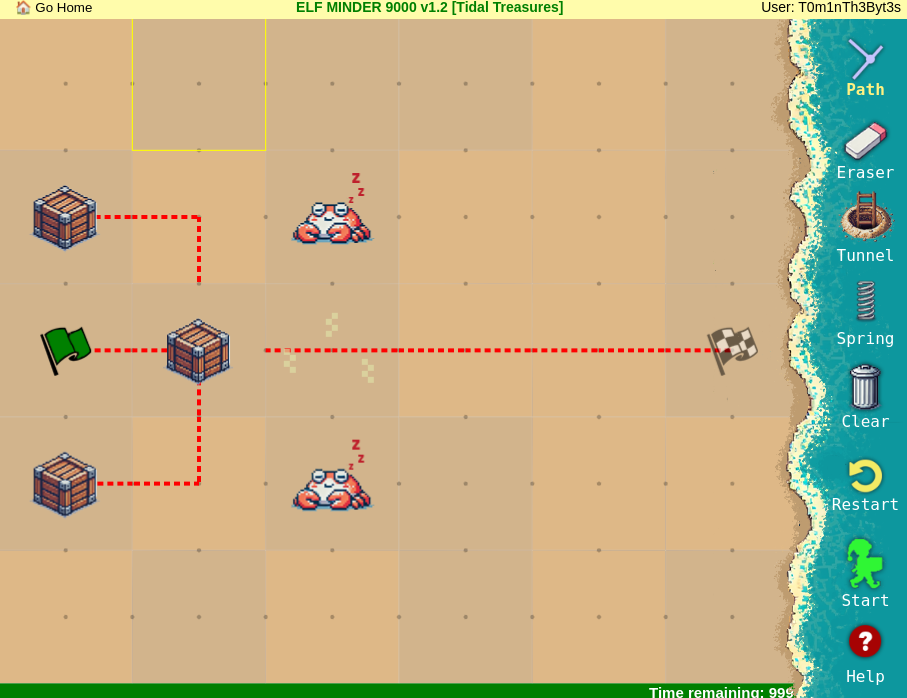

    ??? success "Solution for 'Dune Dash'"

        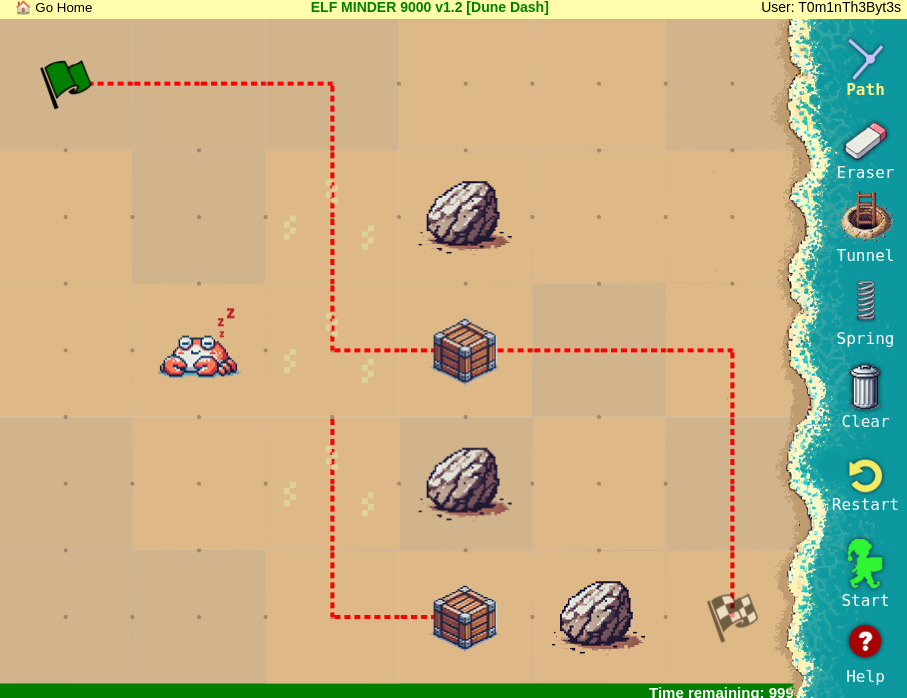

    ??? success "Solution for 'Coral Cove'"

        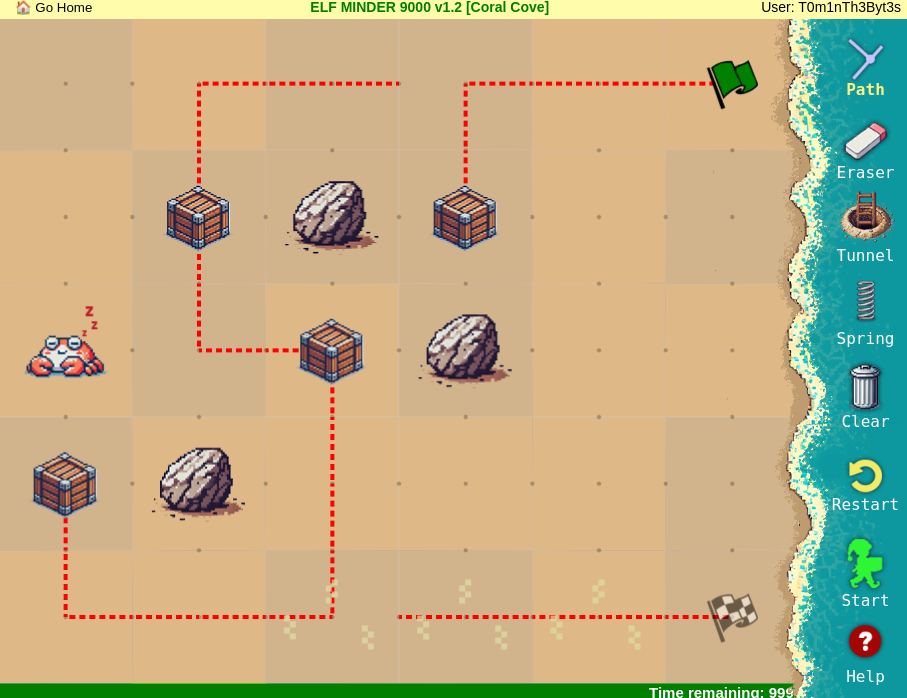

    ??? success "Solution for 'Shell Seekers'"

        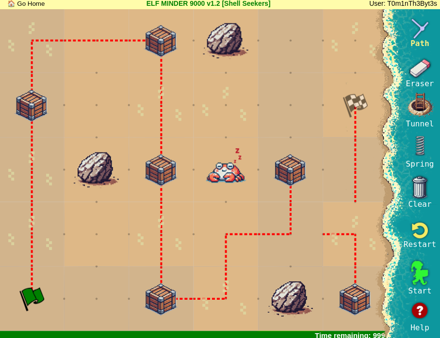

    ??? success "Solution for 'Palm Grove Shuffle'"

        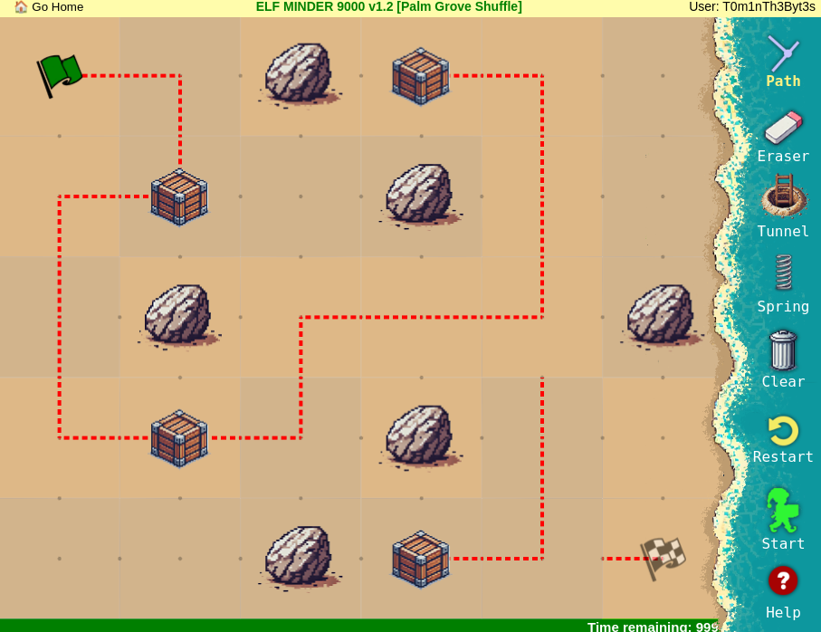

    ??? success "Solution for 'Tropical Tangle'"

        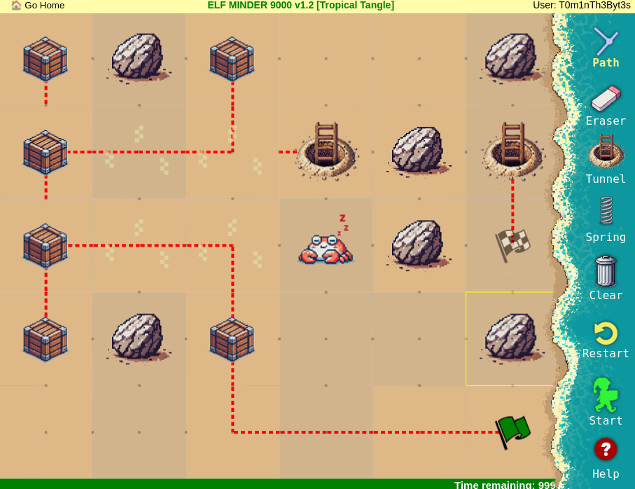

    ??? success "Solution for 'Crate Caper'"

        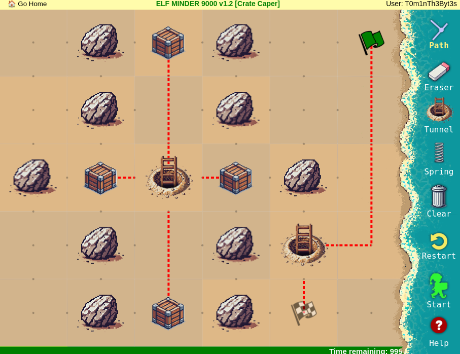

    ??? success "Solution for 'Shoreline Shuffle'"

        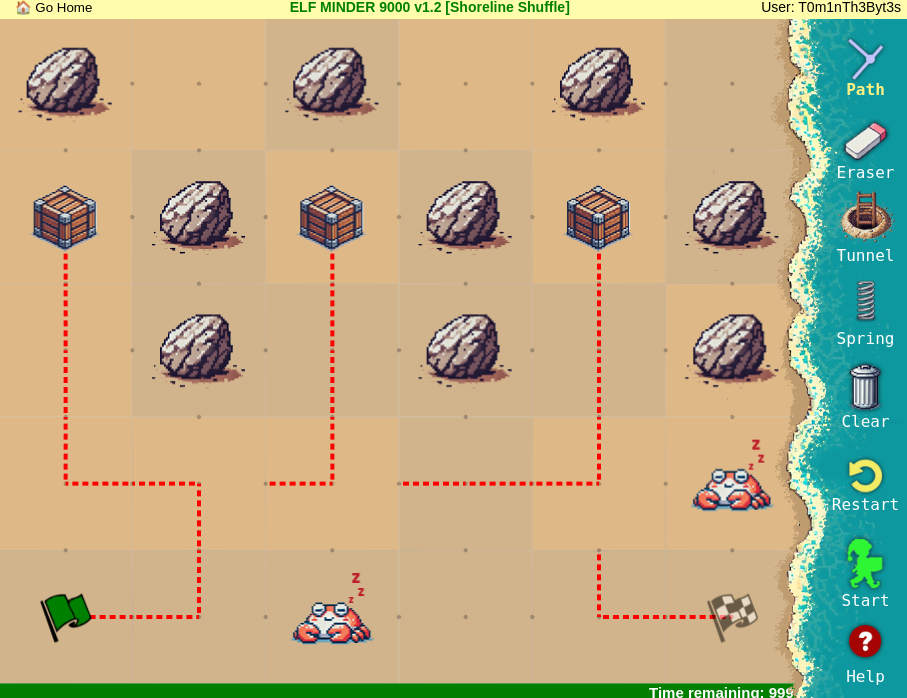

    ??? success "Solution for 'Beachy Bounty'"

        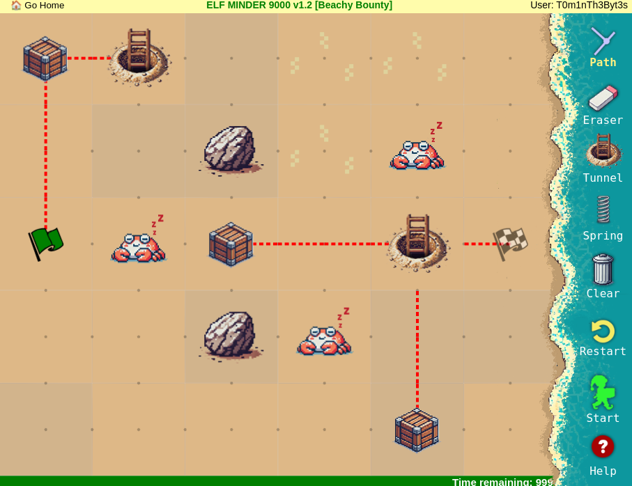

    ??? success "Solution for 'Driftwood Dunes'"

        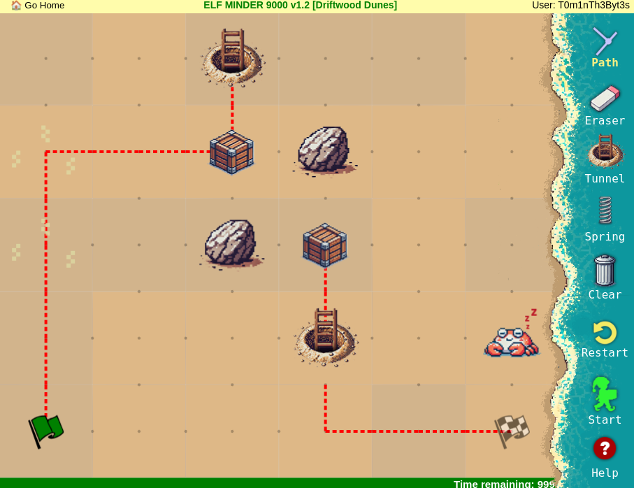

=== "Gold"

    After completing all the levels for the silver achievement, an additional one will appear for gold. This one is unsolvable with the standard ruleset. We need to exploit a bug in the game code to complete it. As mentioned in the hints, there is some funky behavior with the spring entity. Looking through the code, we find the following snippet:

    ``` js title="Bugged code for spring entity in 'guide.js'" linenums="1" hl_lines="20"
        getSpringTarget(springCell) {
            // ..
            do {
                searchIndex += 1;
                nextPoint = [ nextPoint[0] + dx, nextPoint[1] + dy ];

                entityHere = this.entities.find(entity =>
                    ~[
                        EntityTypes.PORTAL,
                        EntityTypes.SPRING,
                    ].indexOf(entity[2]) &&
                    searchIndex &&
                    entity[0] === nextPoint[0] &&
                    entity[1] === nextPoint[1]);
                // ..
                validTarget = this.isPointInAnySegment(nextPoint) || entityHere;
            } while (!validTarget);

            if (this.isPointInAnySegment(nextPoint) || entityHere) {
                if (entityHere) return this.segments[0][0]; // fix this
                // ..
            }
        }
    ```

    !!! example "AI usage"
        ChatGPT was used to quickly analyze and explain this code snippet.

    This code is responsible for computing the next point for the elf when encountering a spring. The game says the following:

    !!! quote "Help documentation"
        When stepped on, springs launch the elf in the current direction of travel. If there isn't a path in that direction, the elf will skip the spring.

    The code therefore needs to check if there is a valid target for the elf to land. It includes a line that suggests that something is broken and needs to be fixed (see highlighted line). Following the logic, if the next valid target found is actually another special entity (a portal/tunnel or a spring), then let the elf land on path segment zero, which actually is the first path put down by the player in the level.

    This means that we can exploit it by deliberately placing a tunnel or spring behind a spring to trigger this logic and start our path placement on the finish to let the elf land on there. A solution to this level would look like this:

    ??? success "Solution for 'A Real Pickle'"

        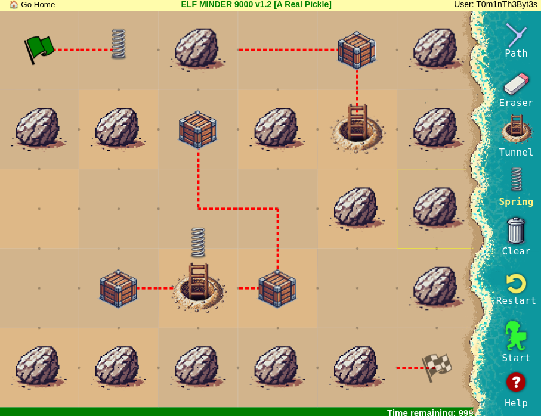

### Images

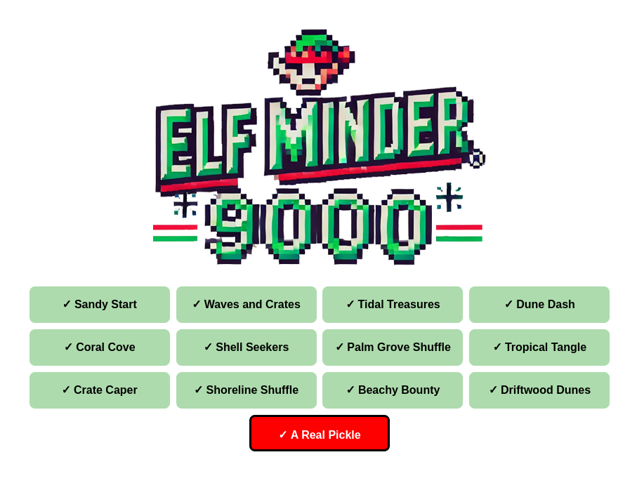

## Response

!!! quote "Poinsettia McMittens"

    The rest of these elves are like corporate zombos. They just run around in circles unless you give them some direction.

    Way to pass them some of your super centered energy. Better you than me, though. I'd let them walk themselves straight off the island.
